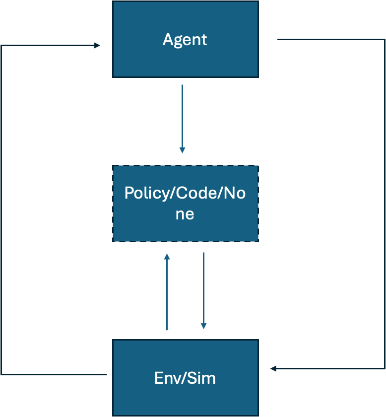

# 按 agent 回路框架重判核心表

框架（2026-10-09）：Agent → Policy / Code / None → Env / Sim；agent 也可以直接作用于 Env / Sim；Env / Sim 的信息回到 agent。箭头表示信息流动，**通用大模型 agent 必须存在，并在其中扮演角色**；箭头不必全部存在，agent 只要连到 Policy / Code 或 Env / Sim 其中之一即可，所以开环（没有 E→A）的论文也保留。agent 必须是**现成的通用大模型**：作者训练或微调过的模型不算（AgentVLN、Ludi、RoboFAC 因此剔除），训练过的 VLA、技能或感知模型只能作为 agent 调用的工具；论文主体必须是 agent，数据生成平台不算。

每篇都读了全文（方法与实验设置），「决策模型」一列写明谁在做决策，括号内 G = 现成通用模型、FT = 作者训练或微调、SPEC = VLA 或专用模型；「原文证据」是论文原句。

对 `data/core/core_table.csv` 的 174 篇逐篇重判：读全文判定（提示词 `screening/prompts/content_rejudge.txt`，原始输出 `data/judging_runs/content_rejudge/`），人工逐条复核，与上一版不同的写在「备注」里。机器可读版本：`data/core/layer_classification.csv`（带 BOM，Excel 可直接打开）；改它后运行 `python3 scripts/build_layer_table.py`。CSV 的「箭头」一列：A→M agent 写出 / 选择 / 修改中间层，A→E agent 直接作用于环境，M↔E 中间层在环境中运行，E→A 环境信息回到 agent。

## 结果

| 结论 | 篇数 | 含义 |
|---|---|---|
| 保留 | 144 | 现成的通用大模型（未经作者训练或微调）作为 agent 存在并起作用（连到 Policy / Code 或 Env / Sim），且 agent 是论文的主体 |
| 资源 | 20 | 以通用大模型 agent 为对象的 benchmark 或评测研究 |
| 剔除 | 10 | 决策者是作者训练或微调的模型、VLA 或专用模型，或论文主体是数据生成平台、资产流水线或 VLA 训练 |

保留的论文按三层分：

| 层 | 子类 | 篇数 | 含义 |
|---|---|---|---|
| L1 | 环境/重建 | 8 | 生成或重建环境、场景、仿真资产、数字孪生 |
| L1 | 奖励/任务 | 12 | 设计奖励、成功判据、任务与课程 |
| L1 | 本体/工具 | 5 | 设计机器人形态、硬件或工具 |
| L1 | 系统/代码 | 17 | 修改训练代码、策略代码库、技能库或 harness，按试验保留或回滚 |
| L2 | 策略生产者 | 20 | 写出在机器人上运行的策略代码或约束（Code as Policies 一类） |
| L2 | 编排者 | 49 | 规划并调用技能、工具、运动规划器或 VLA |
| L2 | 经验迁移 | 7 | agent 的经验、示范或轨迹被蒸馏成策略或更小的模型 |
| L2 | 运行时监控 | 12 | 运行时只在异常时介入：失败检测、安全护栏、恢复、求助 |
| L3 | 直接动作 | 14 | 通用大模型在执行中直接输出动作 |

保留的 144 篇中，31 篇开环（「箭头」一列没有 E→A，多为 2022–2024 的先驱，如 Code as Policies、ReKep）。

## 保留 · L1（42）

准备层：执行之前，agent 为机器人创造或重建环境、设计奖励 / 任务、设计本体与工具、修改系统与训练代码；反馈是训练或仿真结果

### 环境/重建（8）

| 论文 | 年 | 决策模型 | 理由 | 原文证据 | 备注 |
|---|---|---|---|---|---|
| [RoboGen](https://arxiv.org/abs/2311.01455) | 2023（先驱） | GPT-4 backend (plus Gemini-Pro for asset verification), prompted, no training（G） | 现成GPT-4自主提出任务、生成场景与奖励并选择学习算法，论文自称生成式机器人智能体，属于L1准备层。 | We use GPT-4 (OpenAI, 2023) as our LLM backend to query in the current pipeline, which can be upgraded once better models are available. (Sec. 3.1 Task Proposal) | 全文复核改层：原为 L1 奖励/任务 |
| [Eurekaverse](https://arxiv.org/abs/2411.01775) | 2024（先驱） | GPT-4o (prompted with task description and in-context example; RL parkour policies are only the trained downstream learner)（G） | GPT-4o 原样通过提示生成并迭代环境(地形)代码课程，输出进入仿真训练策略，属于 L1 环境生成，训练出的跑酷策略只是下游学习对象。 | "Eurekaverse uses GPT-4o as the LLM, and we run 5 iterations of generation, each with 8 parallel policy training runs of 2000 steps." (5.1 Experimental Setup, Algorithm Details) |  |
| [Video2Policy](https://arxiv.org/abs/2502.09886) | 2025（先驱） | GPT-4o (VLM) writes task code and reward functions; Grounding DINO, SAM-2, InstantMesh and FoundationPose as perception tools（G） | 现成GPT-4o据视频重建信息生成任务场景代码并迭代改写奖励；虽自称数据引擎，但核心是该大模型管线，故保留。 | After extracting the visual information from the video into a task JSON file, we can build the task scene in simulation and learn policies based on GPT-4o. (Sec. 3.2 Task Code Generation and RL) | 全文复核改层：原为 L1 奖励/任务 |
| [Agentic Real2Sim](https://arxiv.org/abs/2607.19190) | 2026 | Gemma 4 31B open-weight VLM (main backend; GPT-5.4, Claude Haiku 4.5, Qwen 3.6 35B swapped in) orchestrating SAM 3 / SAM 3D / FoundationPose tools via LangChain（G） | 现成 VLM(可互换后端)作为智能体编排感知与仿真工具，把真实录像重建为可仿真数字孪生，属于 L1 环境重建；π0.5 微调只是下游应用。 | "The framework's agentic decisions can be driven by an openweight VLM backend at a small fraction of the cost of frontier models, while attaining a comparable conversion success rate." (Abstract) |  |
| [CoDimRecon](https://arxiv.org/abs/2609.36024) | 2026 | GPT-6 Astra agent (Blender authoring, simulator skills, behavioral tests), off-the-shelf with reasoning effort xhigh（G） | 通用 GPT-6 Astra 智能体通过代码/Blender 与仿真技能重建含可变形物体的可仿真场景，并用仿真行为测试迭代修正，属于 L1 环境重建。 | "GPT-6 Astra shares our agent backbone but reconstructs directly from RGB; Sec. 4.3 studies the effect of our reference inputs." (Section 4.2, Results, Comparison with Baselines) |  |
| [SAGE](https://arxiv.org/abs/2602.10116) | 2026 | gpt-oss-120b as agent LLM (with Qwen3-VL-30B-A3B-Instruct for vision-language reasoning), off-the-shelf via MCP tools（G） | 通用开源 LLM/VLM 作为智能体通过 MCP 调用生成器与仿真内批评器自我修正，生成可仿真场景，属于 L1 环境生成；下游扩散策略只是数据用途。 | "Specifically, we adopt gpt-oss-120b [36] as both the agent LLM and the integrated LLM, and Qwen3VL-30B-A3B-Instruct [48] for vision–language reasoning." (Section 4.1.1, Implementation Details) |  |
| [SceneSmith](https://arxiv.org/abs/2602.09153) | 2026 | GPT-5.2 for all designer, critic and orchestrator agents and VLM calls (high reasoning effort)（G） | 通用 GPT-5.2 以设计者/批评者/编排者多智能体方式分层生成含物理属性的可仿真室内场景，属于 L1 环境生成，主题就是智能体系统而非数据集。 | "All agents and VLM calls use GPT-5.2. Designers and critics use high reasoning effort for thorough analysis, while planners use low reasoning for efficient coordination." (Appendix A.2, Model Configuration) |  |
| [Vid2Sid](https://arxiv.org/abs/2602.19359) | 2026 | Google Gemini 2.5 Pro (VLM-in-the-loop, default decoding, no training)（G） | 现成Gemini 2.5 Pro通过提示迭代诊断视频差异并修改仿真物理参数，属于校准数字孪生的通用大模型智能体。 | We use Google Gemini 2.5 Pro [9] with default decoding settings (temperature 1.0, top-P 0.95), held fixed across all seeds and domains (Sec. III-F1 Prompt Design). |  |

### 奖励/任务（12）

| 论文 | 年 | 决策模型 | 理由 | 原文证据 | 备注 |
|---|---|---|---|---|---|
| [Eureka](https://arxiv.org/abs/2310.12931) | 2023（先驱） | GPT-4 (gpt-4-0314) used zero-shot with evolutionary in-context reward search（G） | 未经训练的GPT-4通过进化式上下文迭代编写奖励代码供RL使用，是典型的奖励生成智能体。 | We use GPT-4 (OpenAI, 2023), in particular the gpt-4-0314 variant, as the backbone LLM for all LLM-based reward-design algorithms unless specified otherwise. (Sec. 4 Experiments) |  |
| [GenSim](https://arxiv.org/abs/2310.01361) | 2023（先驱） | GPT-4 prompted (few-shot, RAG, reflection) for task code; GPT-3.5 and Code-Llama fine-tuned only as secondary study（G） | 主结果由现成GPT-4经提示、检索与反思生成仿真任务及场景代码，LLM管线本身是论文核心（微调模型仅为次要实验）。 | We use GPT4 to expand the existing benchmark by ten times to over 100 tasks, on which we conduct supervised finetuning and evaluate several LLMs including finetuned GPTs and Code Llama (Abstract) |  |
| [Language to Rewards](https://arxiv.org/abs/2306.08647) | 2023（先驱） | GPT-4 as Reward Translator (Motion Descriptor + Reward Coder), few-shot prompted（G） | 现成GPT-4仅靠提示把语言转成奖励参数代码，再交给MJPC优化器生成动作，属于通用大模型的奖励生成。 | Sec 4.1: "In all experiments we use GPT-4 as the underlying LLM module"; Sec 3.1: "a Reward Translator, built upon pre-trained Large Language Models (LLMs)"; MJPC is a non-learned optimizer. | 全文复核改层：原为 L2 策略生产者 |
| [Text2Reward](https://arxiv.org/abs/2309.11489) | 2023（先驱） | GPT-4 (gpt-4-0314) prompted with Pythonic env abstraction, few-shot retrieval and code-execution feedback（G） | 现成GPT-4通过提示与执行反馈生成稠密奖励代码并交给RL训练，属于奖励生成的通用大模型智能体。 | We use GPT-4 as the LLM to demonstrate our method and further includes an examination of other open-source models (Sec. 3 Experiment Setup). This work mainly uses gpt-4-0314. |  |
| [Agentic Skill Discovery](https://arxiv.org/abs/2405.15019) | 2024（先驱） | gpt-3.5-turbo proposes tasks and writes reward and success functions; gpt-4-vision-preview verifies success; no LLM training（G） | 现成GPT-3.5与GPT-4V负责提出任务、编写奖励和成功函数并验证行为，RL训练出的技能库只是被调用的工具。 | We employ gpt-3.5-turbo to propose tasks and generate reward and fast success functions ... apply gpt-4-vision-preview, which verifies the success of task completion. (Sec. Experiments, LLMs) |  |
| [CurricuLLM](https://arxiv.org/abs/2409.18382) | 2024（先驱） | GPT-4-turbo as curriculum generator, reward-code writer and policy evaluator, prompted only（G） | 现成GPT-4-turbo设计任务课程并编写各子任务奖励代码，再依据轨迹统计评估策略，属于课程与奖励设计智能体。 | Finally, we use OpenAI's GPT-4-turbo [16] as LLM agents throughout the experiments. (Sec. Experiments, Results) |  |
| [DrEureka](https://arxiv.org/abs/2406.01967) | 2024（先驱） | GPT-4 backbone LLM (Eureka-style prompting), no training of the LLM（G） | 现成GPT-4生成奖励函数和域随机化配置供仿真训练并迁移到真机，属于准备层的奖励与仿真参数设计。 | DrEureka uses GPT-4 [65] as the backbone LLM, and we use the original Eureka hyperparameters for reward generation before sampling 16 DR configurations. (Sec. V Experiments, Methods) |  |
| [OMNI-EPIC](https://arxiv.org/abs/2405.15568) | 2024（先驱） | Claude 3 Opus (task generator, environment generator, interestingness check) + GPT-4o (success detector, reflection), all off-the-shelf and prompted（G） | 通用 LLM/VLM 通过提示自动提出任务并生成环境与奖励代码、判断成功，输出接入仿真训练，属于 L1 任务/奖励生成；RL 智能体只是下游学习者。 | "Claude 3 Opus (claude-3-opus-20240229) ... OpenAI GPT-4o (gpt-4o-2024-05-13)" (Appendix K, Table 1: OMNI-EPIC hyperparameters, per-component Client/Model) | 全文复核改层：原为 L1 环境/重建 |
| [FIND](https://arxiv.org/abs/2609.32069) | 2026 | GPT-5.6 Terra VLM agent for task selection and success evaluation; frozen fine-tuned pi0.5 VLA plus residual RL as the tool policy（G） | 现成GPT-5.6 Terra负责场景条件任务选择与成对图像成功判定（奖励），受训VLA与残差策略只是被调用的工具。 | Considering both evaluation accuracy and response efficiency, we use GPT-5.6 Terra for both supervisory components in the subsequent real-world experiments. (Sec. IV-B, VLM agent evaluation) |  |
| [RDA](https://arxiv.org/abs/2606.01672) | 2026 | GPT-5 (medium reasoning) as VLM backbone; GPT-4.1 only as evaluation judge（G） | 现成GPT-5作为智能体通过提示迭代生成并修订奖励代码，属于未经训练的通用大模型且头条贡献即该智能体，归入L1奖励/任务。 | Experiments (Training): "RDA uses GPT-5 (OpenAI, 2025b) with medium reasoning effort as the VLM backbone. ... GPT-5 proposes multiple reward candidates, trains a policy under each candidate" |  |
| [RF-Agent](https://arxiv.org/abs/2602.23876) | 2026 | GPT-4o-mini-0718 and GPT-4o-0806 (prompted, MCTS over reward code)（G） | 现成GPT-4o系列通过提示与树搜索自动设计奖励函数，无需微调，是以智能体为主体的L1奖励/任务工作。 | Method Implementation: "In IsaacGym, we set the total limit to 80 and use the GPT-4o-mini-0718 and GPT-4o-0806 models for LLM implementation"; training-free in-context reasoning |  |
| [ROOT](https://arxiv.org/abs/2610.04250) | 2026 | Claude 4.5 Sonnet (Proposer/Critic/Strategist agents) with Gemini 3.1 Pro as video critic（G） | 现成Claude与Gemini通过提示和经验树搜索生成并改进奖励程序，无任何微调，属于L1奖励/任务的智能体工作。 | Experiments: "All methods use Claude 4.5 Sonnet as the same backbone language model for reasoning and reward code generation. ... we employ Gemini 3.1 Pro as the Vid-LLM model" |  |

### 本体/工具（5）

| 论文 | 年 | 决策模型 | 理由 | 原文证据 | 备注 |
|---|---|---|---|---|---|
| [RoboMorph](https://arxiv.org/abs/2407.08626) | 2024（先驱） | GPT-4o with best-shot few-shot prompting（G） | 现成GPT-4o通过少样本提示进化生成机器人形态并送入仿真评估，属于L1本体/工具，大模型未经训练且是方法核心。 | Sec. II: "robot designs generated by an LLM (specifically, GPT-4o) ... prompted with few-shot examples and produces new designs expressed in a grammar-based representation"; no fine-tuning |  |
| [RobotSmith](https://arxiv.org/abs/2506.14763) | 2025（先驱） | Proposer/Critic/Tool-User VLM agents (o3-mini) prompted via API（G） | 现成o3-mini类VLM通过提示协作设计工具并生成使用轨迹，无任何训练，核心贡献是智能体式工具设计，归入L1本体/工具。 | Sec. 3.2: "two collaborating vision-language model (VLM) agents: a Proposer agent and a Critic agent based on o3-mini". Appendix E: "We use API calls to models such as O3-Mini and Meshy for tool design" |  |
| [VLMgineer](https://arxiv.org/abs/2507.12644) | 2025（先驱） | gemini-2.5-pro-preview-03-25 prompted zero-shot with evolutionary in-context mutation/crossover（G） | 现成Gemini 2.5 Pro通过提示与进化搜索共同设计工具和动作，虽附带RoboToolBench但头条是智能体框架，归入L1本体/工具。 | Appendix VIII-C6: "We used gemini-2.5-pro-preview-03-25 as our VLM model throughout the entire experiment"; VLMgineer works "off-the-shelf for new tasks without task-specific templates, prompts, or examples" |  |
| [Continuum Robot Design](https://arxiv.org/abs/2609.08220) | 2026 | GPT-5 powering Designer/Coder/Scene Integrator/Judge agents (prompted, no training)（G） | 现成GPT-5多智能体通过提示与仿真反馈迭代生成连续体机器人本体设计，没有训练大模型，归入L1本体/工具。 | Sec. IV-B: "All agents in our framework are powered by GPT-5, unless specified otherwise in our ablation studies."; RL (PPO) is only a downstream evaluation of designs |  |
| [LACE-CRAFT](https://arxiv.org/abs/2610.09283) | 2026 | GPT-5.6-sol (temperature 1.0) in four CRAFT roles: Feedback, Morphology, Reward, Integration（G） | 智能体由现成GPT-5.6-sol通过提示充当，输出形态与奖励代码进入仿真训练；LACE部分是RL迁移技巧但CRAFT多角色智能体是头条系统之一，故保留，归L1本体/工具。 | Sec. IV: "D2C, LACE–CRAFT, and the ablation variants use GPT–5.6-sol and propose six morphology–reward pairs per round"; App. F: "recorded model identifier is GPT-5.6-sol with temperature 1.0" |  |

### 系统/代码（17）

| 论文 | 年 | 决策模型 | 理由 | 原文证据 | 备注 |
|---|---|---|---|---|---|
| [LRLL](https://arxiv.org/abs/2406.18746) | 2024（先驱） | gpt-3.5-turbo (frozen) as actor-critic, explorer and skill abstractor（G） | 冻结的gpt-3.5-turbo通过记忆与提示不断扩充技能库，无梯度训练，核心是技能库/代码系统的自我扩展。 | To stay within in-context learning, we use a frozen LLM to generate the policy code ... We leverage OpenAI's gpt-3.5-turbo engine for all LLM generations (Intro; IV-A Implementation) | 全文复核改层：原为 L2 策略生产者 |
| [AGRO-SUVIDE](https://arxiv.org/abs/2609.34823) | 2026 | Unnamed off-the-shelf coding agent (SKILL.md spec, VLM queried from library); ACT policies only as trained skills（G） | 论文未点名智能体所用模型，但作者只训练了作为工具的ACT技能，决策智能体为现成编码代理，负责识别并编写技能库。 | Procedural model-based skills are coded directly by the agent over a scaffolded library B. All four stages are specified to the agent in a textual specification M, written in Anthropic's SKILL.md format. | 全文复核改层：原为 L2 策略生产者 |
| [ASPIRE](https://arxiv.org/abs/2607.00272) | 2026 | Claude Code with Claude Opus 4.6 (sim); OpenAI Codex GPT-5.5 (real robot)（G） | 现成Claude Opus 4.6编码代理迭代调试机器人程序并把验证过的修复沉淀为技能库，属系统/代码准备层。 | For all the simulation benchmarks, we use Claude Code with Claude Opus 4.6 and a 1M-token context window as the coding agent. The agent writes executable Python robot programs in CaP-X. (3.1 Experimental Setup) | 全文复核改层：原为 L2 策略生产者 |
| [AdaHVLA](https://arxiv.org/abs/2609.29204) | 2026 | GPT-5.6-sol Max (and other frontier LLMs) revise harness code; Qwen3.7-Flash is runtime reasoning agent; VLAs fixed（G） | 现成前沿大模型通过提示根据机器人经验修订协调VLA的harness代码并按试验保留或回退，VLA仅作为被调用工具，归L1系统/代码。 | Sec. VI: "manipulation uses GPT-5.6-sol Max. All harnesses use Qwen3.7-Flash as the runtime reasoning agent." and "VLA parameters and controllers remain fixed." |  |
| [ENPIRE](https://arxiv.org/abs/2606.19980) | 2026 | Codex GPT-5.5 xhigh, Claude Code Opus 4.7, Kimi Code Kimi K2.6 (coding agents)（G） | 现成通用编码智能体(GPT-5.5/Opus 4.7)作为智能体，编写环境、奖励和训练代码并按真机试验结果迭代，属于系统/代码层。 | "We benchmark three coding agents in our physical autoresearch experiments, namely, Codex with GPT-5.5 xhigh, Claude Code with Opus 4.7 High, and Kimi Code with Kimi K2.6 thinking." (Sec. 3) |  |
| [EmboCoach-Bench](https://arxiv.org/abs/2601.21570) | 2026 | Claude Opus 4.5, Gemini 3.0 Pro, GPT-5.2, DeepSeek V3.2-Thinking, Kimi-K2-Thinking, Qwen3-Coder-Plus, GLM-4.6 as RoboCoach agent; Qwen3VL-235B-A22B-Instruct as video diagnosis tool（G） | 头条贡献是RoboCoach这一由现成通用LLM驱动的闭环智能体系统，自主编写并迭代训练代码和奖励，基准只是用来评测该系统。 | Methods: "The video-feedback analysis tool in the agentic condition is implemented with Qwen3VL-235B-A22B-Instruct. Seven frontier language models are evaluated across both conditions: Claude Opus 4.5, Gemini 3.0 Pro, GPT-5.2, DeepSeek V3.2-Thinking" | 全文复核改判：原为资源 |
| [HARBOR](https://arxiv.org/abs/2606.08610) | 2026 | Claude Code agents with Opus 4.7 (Sonnet 4.6 ablation)（G） | 通用LLM编码智能体(Opus 4.7)原样使用，自动完成任务、奖励与算法调参的整条RL工程流水线，属于系统/代码层。 | "We use default N = 4 for parallelization and Opus 4.7, while results for Sonnet is in Appx. D.6." (Sec. 4.3) and "all methods use the same Opus backbone" (Sec. 4.3) |  |
| [PhysEvo](https://arxiv.org/abs/2610.08995) | 2026 | Frozen GPT-6 Astra as both task agent and meta-agent（G） | 冻结的通用模型Astra既执行任务又修改自身工具与技能(无权重更新)，以试验保留或回退修订，属于系统/代码层。 | "This process develops joint-level control, evidence-seeking observation, and reusable manipulation skills without model-weight updates or a separately trained action policy." (Abstract) |  |
| [RATs (Playful)](https://arxiv.org/abs/2606.19419) | 2026 | gemini-3.1pro-preview (play phase); gpt-5.5 in token-cost analysis（G） | 通用大模型(Gemini 3.1 Pro)免微调，通过自主玩耍编写并沉淀代码技能库，属于系统/代码层。 | "we play on LIBERO-PRO and MolmoSpaces environment for 50 iterations each with gemini-3.1pro-preview" (Sec. 4.1) ... "without finetuning the underlying model" (Abstract) |  |
| [RHD](https://arxiv.org/abs/2609.33378) | 2026 | GPT-6 Astra (strong agent) and GPT-5.6 Luna (light agent), both frozen; frozen GR00T and fine-tuned pi0.5 VLAs as tools（G） | 参数冻结的GPT-6 Astra/GPT-5.6 Luna通过试验把干预经验提炼并按开发集成功率验收修订playbook(harness)，再由轻量智能体在运行时干预VLA，核心贡献属准备层的系统/harness编辑。 | We use GPT-6 Astra as the strong agent and GPT-5.6 Luna as the light agent. Astra collects interaction experience with GR00T and revises the playbook (4.1 Agents); model parameters also remain fixed (3.1) | 全文复核改层：原为 L2 经验迁移 |
| [RHO](https://arxiv.org/abs/2606.16458) | 2026 | Codex GPT-5.5 xhigh (headline); Claude Code Opus 4.7 / Sonnet 4.6 and Qwen3.6-27B as alternates（G） | 现成通用编码智能体在训练时演化多文件策略代码仓库并按奖励保留或淘汰，部署时不再调用LLM，属于系统/代码层。 | "Our experiments use OpenAI Codex and Claude Code agents as backends." (Sec. 4) and "Codex backends use OpenAI's Codex CLI with gpt-5.5 at reasoning effort xhigh." (Appendix) |  |
| [RPG](https://arxiv.org/abs/2610.02204) | 2026 | Gemini 3.8 Flash runtime agent; Fable 5.1 for offline code revision（G） | 通用多模态大模型(Gemini 3.8 Flash/Fable 5.1)不更新权重，在仿真练习中修订技能库与系统提示并经跨任务验证后保留，属于系统/代码层。 | "a framework for autonomous improvement of robot execution systems without updating model weights" (Abstract). "RPG uses Fable 5.1 for offline code revision during self-improvement" (Sec. IV) |  |
| [SPINE](https://arxiv.org/abs/2607.13049) | 2026 | Claude Code with Claude Sonnet 5.0 and subagents（G） | 通用Claude Code智能体原样使用，编辑驱动与配置代码并指导物理排障直至遥操作就绪，属于系统/代码层(对象为集成栈而非任务策略)。 | "SPINE runs within Claude Code and centers on two subagent-driven workflows: a profile builder and a debugger" (Sec. I); "Claude Code with Claude Sonnet 5.0" (Sec. IV) |  |
| [SimEX](https://arxiv.org/abs/2609.38982) | 2026 | Fable 5.1 coding agent (also Opus 5, GPT-5.5, GPT-6 Astra)（G） | 通用前沿编码智能体原样使用，在仿真与少量真机试验中迭代工具箱代码与使用说明，属于系统/代码层。 | "All coding-agent and policy-writing calls use Fable 5.1, with maximum reasoning effort in Stage 1 and medium reasoning effort in Stage 2" (Sec. 3.1) |  |
| [Skill-Harness Evolution](https://arxiv.org/abs/2608.11350) | 2026 | Frozen Qwen3.6-27B as planner and optimizer (SHAPER), with fine-tuned pi0 executor as tool（G） | 冻结的通用VLM(Qwen3.6-27B)既做规划者又做优化者，只演化外部技能与上下文代码，微调的pi0仅作工具，属于系统/代码层。 | "All agent-system variants use Qwen3.6-27B as the frozen upper-level planner at evaluation." (Sec. 4.1); "keeps model parameters frozen" (Abstract) |  |
| [Skill2Real](https://arxiv.org/abs/2610.02788) | 2026 | GPT-5.6 Sol and Claude Opus 5 train skills; GPT-6 Astra / Opus evaluate as Proposer（G） | 现成通用大模型(Sol/Opus 5/Astra)作为提议者、验证者与治理者，在仿真中习得并冻结代码技能库，无权重训练，属于系统/代码层。 | "Skill2Real transfers a frozen hierarchy of executable Cerebellum and Brain skills learned in simulation, rather than model parameters." (Sec. 3); "the Proposer, Verifier, and Governor use the same model" (App. B) |  |
| [Zetta](https://arxiv.org/abs/2608.16590) | 2026 | Orchestrator and Evolutionary Agents are frozen frontier multimodal LLMs (cites Claude Sonnet 4.5, GPT-5.5, GPT-5.6) over frozen pi0.5 / GR00T N1.5 VLA policies（G） | 通用前沿大模型作为冻结的编排与进化智能体，离线改写批评器和恢复技能代码并经验证门控保留，属于系统/代码层，VLA仅作被调用工具。 | Sec 2.1.2: "Acting as a fixed multimodal reasoning operator [72–74], A_orch functions as a high-level commander... Its decision logic remains constant during evolution." Sec 4.1: "does not involve fine-tuning the weights of these base VLA models." |  |

## 保留 · L2（88）

中间层（harness）：agent 经由中间的 Policy / Code 影响机器人——写出运行的策略代码、调用技能或 VLA、把经验蒸馏给策略、在运行时监控与恢复

### 策略生产者（20）

| 论文 | 年 | 决策模型 | 理由 | 原文证据 | 备注 |
|---|---|---|---|---|---|
| [Code as Policies](https://arxiv.org/abs/2209.07753) | 2022（先驱） | OpenAI Codex code-davinci-002 few-shot prompted (also GPT-3 / InstructGPT / PaLM comparisons)（G） | 现成代码大模型仅靠少样本提示直接生成在机器人上运行的策略代码，符合通用大模型作为策略生产者。 | Sec III-B: "All examples and experiments in this paper, unless otherwise stated, use OpenAI Codex code-davinci-002 with temperature 0"; Sec I: "off-the-shelf models and few-shot prompting with no additional training." |  |
| [AutoTAMP](https://arxiv.org/abs/2306.06531) | 2023（先驱） | GPT-4 and GPT-3 few-shot translator and checker (T5 NL2TL fine-tuned only as ablation)（G） | 现成GPT-4/GPT-3少样本生成STL约束并自检后交给运动规划器执行，属于通用大模型生成约束的策略生产者。 | Intro: "in-context learning with pre-trained LLMs is well suited for language-to-task-specification translation"; Sec IV: "we evaluate performance with both GPT-3 and GPT-4 as the LLM." NL2TL fine-tuned model only an ablation. |  |
| [DROC](https://arxiv.org/abs/2311.10678) | 2023（先驱） | GPT-4 for all LLM modules (task planner, code-writing skill composer, correction handler, knowledge extractor and retriever) with SAM+CLIP perception（G） | 现成 GPT-4 仅靠提示重新规划并生成机器人控制代码，经验以文本知识库形式提炼检索而非训练模型，属于 L2 策略生产者。 | We evaluate our approach on a real-world tabletop environment with a Franka Emika Panda Robot. We use GPT-4 [44] for all LLM modules. (IV Experiments) | 全文复核改层：原为 L2 编排者 |
| [VoxPoser](https://arxiv.org/abs/2307.05973) | 2023（先驱） | GPT-4 (OpenAI API) writing code, with OWL-ViT + SAM perception and MPC planner（G） | 现成GPT-4零样本写代码组合3D价值图作为约束与目标交给运动规划器，属于通用大模型的策略/约束生产者。 | Sec 4: "We use GPT-4 from OpenAI API"; Fig 1: "without additional training to either component." Only an optional MLP dynamics model is learned from online interaction. |  |
| [CoPa](https://arxiv.org/abs/2403.08248) | 2024（先驱） | GPT-4V (with SoM segmentation, GraspNet, motion planner as tools)（G） | 现成GPT-4V仅靠提示生成部件空间约束并由求解器转为位姿，属于通用大模型生产策略约束。 | We employ GPT-4V from OpenAI API as the VLM. CoPa involves minimal few-shot prompts to aid VLMs in comprehending their roles. (IV-A VLMs and Prompting) |  |
| [MOKA](https://arxiv.org/abs/2403.03174) | 2024（先驱） | GPT-4V prompted with marked images (zero-shot and in-context); Octo only for distilled baseline（G） | 主结果为零样本提示GPT-4V输出亲和点与路径点驱动运动，蒸馏到Octo只是附加实验。 | By prompting the pre-trained VLM, our approach utilizes the VLM's commonsense knowledge ... we leverage GPT-4V for robotic manipulation. (Abstract; II Related Work) |  |
| [ReKep](https://arxiv.org/abs/2409.01652) | 2024（先驱） | GPT-4o writes constraints; DINOv2 proposes keypoints（G） | 现成GPT-4o生成关键点约束代码交给求解器输出动作，属于通用模型生产策略约束。 | For the experiments conducted in this work, we use GPT-4o as it is one of the latest available (Appendix, VLM prompting); image and instruction fed into GPT-4o to generate ReKep constraints (Fig. 2) |  |
| [OmniManip](https://arxiv.org/abs/2501.03841) | 2025（先驱） | GPT-4o prompted with interaction examples (with GroundingDINO/SAM, GenPose++, grasp model as tools)（G） | 现成GPT-4o仅靠提示输出物体中心交互基元与空间约束并经VLM闭环校验，无需微调，属策略约束生产。 | We use GPT-4O from OpenAI API as the vision-language model, leveraging a small set of interaction examples as prompts to guide the model's reasoning for manipulation tasks. (Experiments, Implement Details) |  |
| [PDDLLM](https://arxiv.org/abs/2505.18382) | 2025（先驱） | GPT-4o (default; Qwen3-4B/8B only as off-the-shelf ablation backbones)（G） | 现成GPT-4o通过提示从单次演示生成PDDL规划域与物理约束并交给运动规划器执行，属于编写运行于机器人上的规划约束的策略生产者。 | Sec. 6: "We use GPT-4o (OpenAI, 2023), but our method is not tied to this backbone." Domain induced from one demonstration by prompting; no LLM fine-tuning | 全文复核改层：原为 L1 系统/代码 |
| [ASENA](https://arxiv.org/abs/2609.39207) | 2026 | Claude Sonnet 5 and GPT-6 Astra coding agents (weights fixed) writing programs/skills; optional trained 4B ASENA-VLN navigation policy as a tool（G） | 通用编码智能体权重固定，编写并迭代机器人程序与技能（兼有 L1 技能库演化），训练的 4B 导航策略仅为可选工具，故保留。 | Abstract: "Agents can write and execute programs, inspect recorded outcomes, repair failures, and reuse notes and executable skills while keeping their model weights fixed." ASENA-VLN "serves as an optional tool". | 全文复核改层：原为 L2 编排者 |
| [Agentic RSR](https://arxiv.org/abs/2610.10479) | 2026 | Codex agents powered by GPT-6 Astra (high reasoning effort), prompted, no training（G） | 通用 GPT-6 Astra 编码智能体既重建仿真场景又在仿真中迭代编写可执行策略程序并带回真机、运行时可重试恢复，主线是 L2 策略生产者(兼有 L1 环境重建)。 | "Unless noted, Agentic RSR uses Codex agents (OpenAI, 2026) powered by GPT-6 Astra with high reasoning effort; the model-swap ablation uses the stated alternative." (Experimental Setup) | 全文复核改层：原为 L1 环境/重建 |
| [AquaCap](https://arxiv.org/abs/2609.23133) | 2026 | DeepSeek-V4-Pro (Policy agent), DeepSeek-V4-Flash (Coding agent), Qwen3.7-Flash (VLM) via cloud APIs（G） | 训练无关的现成DeepSeek与Qwen模型生成水下控制代码并带失败记忆重规划，微调的OpenVLA仅为基线。 | Policy, Coding, and VLM use DeepSeek-V4-Pro, DeepSeek-V4-Flash, and Qwen3.7-Flash through cloud APIs, respectively; SAM3 runs locally. We fine-tune OpenVLA on the USIM dataset ... as a baseline. (Experiments) |  |
| [Beyond Human Demos](https://arxiv.org/abs/2609.24996) | 2026 | Unnamed general coding agent prompted to write and refine guardrail code (GLIDE); pi0.5 VLA fine-tuned only as downstream policy（G） | 由未点名的通用编码智能体仅靠提示写出并迭代改进在机器人上运行的护栏约束代码，属生成运行时约束的策略生产者；训练的pi0.5只是下游策略，但模型型号未披露属边界判断。 | To initialize G(0)_GLIDE, GLIDE prompts a coding agent with the task description and the conditioning teleoperation code T ... GLIDE revises the code using recorded videos and logged state-command tuples. (Sec. 3.1-3.2) | 全文复核改层：原为 L2 运行时监控 |
| [Embodiment Meets Environment](https://arxiv.org/abs/2606.28592) | 2026 | Unnamed off-the-shelf LLM-based reasoner (constraint synthesis and scene-graph pruning) with PDDL planner, CBF-QP filter, fine-tuned Pi0.5 only as a skill（G） | 论文未点名LLM型号且无任何微调，现成LLM依据场景图合成约束并由控制屏障函数在运行时强制执行，属于生成约束的策略生产者(Pi0.5只是被调用的技能)。 | Soft constraints are generated by querying an LLM-based reasoner with the task specification, user preferences, and the task-relevant subgraph; the reasoner outputs symbolic constraint tuples (IV-C Constraint Synthesis) |  |
| [FAEA](https://arxiv.org/abs/2601.20334) | 2026 | Claude Opus 4.5 (claude-opus-4-5-20251101) inside the unmodified Claude Agent SDK ReAct loop（G） | 现成 Claude Agent SDK 通过试错迭代编写并修订在仿真中运行的 episode 脚本，属于 L2 策略生产者。 | "FAEA ... applies an LLM agent framework directly to embodied manipulation without modification." "We use Claude Opus 4.5 (claude-opus-4-5-20251101) for all experiments" (Abstract, Section III-A) | 全文复核改判：原为资源 |
| [GTA-2](https://arxiv.org/abs/2609.09808) | 2026 | Gemini 3.1 Pro for all four VLM agents (Task Decomposer, Skill Generator, Parameter Setter, Vision Module)（G） | 现成Gemini 3.1 Pro零样本生成任务轴控制器组合并编译成可执行脚本，无训练或微调，属于生产策略代码的通用模型。 | We use Gemini 3.1 Pro for all four VLM agents. (Experiments); skill generated without task-specific robot demonstrations, policy training, or fine-tuning (Sec. III Method) |  |
| [KPI](https://arxiv.org/abs/2609.36151) | 2026 | GPT-6 Astra (Analyzer, Detector, Verifier as role-conditioned calls to the same VLM), unmodified SONIC whole-body tracker and the authors' non-learned KPI impedance kernel as tools（G） | 主实验均为现成GPT-6 Astra从一条指令写出参考轨迹与接触合同并交给KPI控制器执行，无训练，故判为策略生产者；控制器内核本身是另一半贡献，属边界案例。 | GPT-6 Astra implements Analyzer, Detector, and Verifier. Each zero-shot agentic trial starts from one instruction, without task-specific code or a manually supplied contract. (IV Experiments) |  |
| [NORM-Nav](https://arxiv.org/abs/2605.16979) | 2026 | Qwen-VL-Max (API) parses instructions into constraints; Grounded-SAM2, costmap, A* and TEB planners as tools（G） | 现成Qwen-VL-Max零样本把语言约束解析为结构化约束并写入多层代价地图供传统规划器执行，无任何训练，属于生成约束的策略生产者。 | Behavioral instructions are parsed using Qwen-VL-Max. (IV-A.4 Implementation Details); zero-shot framework ... without relying on additional task-specific training (IV Methodology) |  |
| [Real2Gym](https://arxiv.org/abs/2609.37089) | 2026 | GPT-6 Astra (medium reasoning effort) for scene construction, policy execution and skill extraction; no model weight updates（G） | 通用 GPT-6 Astra 智能体在重建的仿真环境中生成可执行的阶段代码并沉淀技能(不更新权重)后迁移到真机，核心是 L2 策略生产者(并含 L1 环境重建)。 | "Scene construction, policy execution, and skill extraction all use GPT-6 Astra with medium reasoning effort." (Section 4, Implementation Details) | 全文复核改层：原为 L1 环境/重建 |
| [VLS](https://arxiv.org/abs/2602.03973) | 2026 | Unnamed off-the-shelf VLM (queried for stage decomposition, reward code and stage switching) with SAM, DINOv2; frozen pi0/pi0.5/OpenVLA/diffusion policies as the steered tool（G） | VLM未被训练，仅提示生成程序化奖励函数来引导冻结策略的去噪，奖励代码直接作用于机器人运行时；虽未点名VLM型号，仍是通用模型生产策略奖励(边界案例)。 | VLS ... a training-free framework for inference-time adaptation of frozen generative robot policies ... the VLM itself remains a non-differentiable, off-graph component. (Abstract; IV-A.2) |  |

### 编排者（49）

| 论文 | 年 | 决策模型 | 理由 | 原文证据 | 备注 |
|---|---|---|---|---|---|
| [Inner Monologue](https://arxiv.org/abs/2207.05608) | 2022（先驱） | InstructGPT 1.3B (sim and real tabletop) and PaLM 540B (kitchen), frozen with few-shot prompts, plus pretrained CLIPort-style and SayCan skills（G） | 冻结的InstructGPT与PaLM仅靠少样本提示，读取成功检测与场景描述等语言反馈后选择并重规划预训练技能，是典型的通用大模型编排者。 | we use pre-trained LLMs for planning that are not finetuned, but rather evaluated solely with few-shot prompting (3.2 Inner Monologue); We use PALM, a 540B parameter language model (Appendix, Kitchen Mobile Manipulation) |  |
| [LM-Nav](https://arxiv.org/abs/2207.04429) | 2022（先驱） | GPT-3 (3-shot prompt for landmark extraction) + frozen CLIP grounding + pretrained ViNG navigation model as executor（G） | 现成 GPT-3 仅靠少样本提示把指令拆成地标序列，再交给图搜索与预训练导航策略执行，属于通用大模型编排预训练工具的 L2 编排者。 | For all experiments, the weights of LLM, VLM, and VNM are frozen — there is no fine-tuning or annotation in the target environment. (5 System Evaluation) |  |
| [ProgPrompt](https://arxiv.org/abs/2209.11302) | 2022（先驱） | GPT-3 (main backbone; Codex and Davinci variants compared), few-shot program-style prompts（G） | 现成GPT-3通过程序式提示生成调用动作原语的任务计划程序，属于通用大模型编排技能的智能体。 | Sec V-A: "We utilize a GPT3 as a language model backbone to receive PROGPROMPT prompts and generate plans." Prompt = program header, object list, 3 fixed example programs; no LLM training. | 全文复核改层：原为 L2 策略生产者 |
| [SayCan](https://arxiv.org/abs/2204.01691) | 2022（先驱） | PaLM 540B (few-shot prompted, scores skill descriptions) + trained BC/RL skills and value functions as affordance tools（G） | 冻结的 PaLM 通过提示与技能价值函数结合逐步选择并调用已训练技能，被训练的只是作为工具的技能策略，属于 L2 编排者。 | The LLM used is 540B PaLM [9] unless stated otherwise for LLM ablations. We refer to SayCan with PaLM as PaLM-SayCan. (5 Experimental Setup) |  |
| [Socratic Models](https://arxiv.org/abs/2204.00598) | 2022（先驱） | GPT-3 175B (prompted LM) composed with CLIP, ViLD, speech-to-text and a pretrained language-conditioned robot policy（G） | 通用框架论文，其机器人演示中现成 GPT-3 零训练地写出调用预训练策略的步骤代码，满足 L2 编排者；机器人只是多个演示之一，属边界案例。 | No model training was used to create our demonstrated results. (6 Discussion, Broader Impacts); the LM is few-shot prompted to generate pseudo code robot.pick_and_place("A", "B") (Appendix, Robot Experiments) |  |
| [ChatGPT for Robotics](https://arxiv.org/abs/2306.17582) | 2023（先驱） | OpenAI ChatGPT (GPT-3.5/GPT-4 class), prompted with a high-level function library and dialogue（G） | 现成ChatGPT仅靠提示工程和高层函数库生成调用机器人API的代码，属于通用大模型编排者；PromptCraft只是附带工具。 | Abstract: "an experimental study regarding the use of OpenAI's ChatGPT for robotics... creation of a high-level function library"; Intro: "capable of solving various robotics-related tasks in a zero-shot fashion." No training. | 全文复核改层：原为 L2 策略生产者 |
| [Incremental Humanoid Learning](https://arxiv.org/abs/2309.04316) | 2023（先驱） | GPT-4 (gpt-4-0613) and GPT-3.5 as interactive console agent plus GPT-4 as L_improve, few-shot prompted（G） | 冻结的GPT-4通过交互式Python控制台编排机器人感知与动作，并用记忆检索实现增量学习，属于通用大模型编排者。 | Fig 5: "We use an LLM (in our experiments, GPT-4) to control robot perception and action given a prompt of few-shot examples"; Sec IV: "we compare gpt-3.5-turbo-0301 and gpt-4-0613... For L_improve, we always use gpt-4." | 全文复核改层：原为 L2 策略生产者 |
| [Look Before You Leap](https://arxiv.org/abs/2311.17842) | 2023（先驱） | GPT-4V (strict zero-shot prompting, no in-context examples) + pre-existing primitive skills (scripted, RL or BC)（G） | 现成 GPT-4V 零样本看图规划并逐步调用已有技能策略，闭环执行，技能不是本文贡献，属于 L2 编排者。 | We use GPT-4V from OpenAI API as our VLM. Unlike previous approaches [2, 40], we do not include any in-context examples in the prompt ... (strict zero-shot). (IV Experiments, VLM and Prompting) |  |
| [RoCo](https://arxiv.org/abs/2307.04738) | 2023（先驱） | GPT-4 (one prompted LLM agent per robot, dialog) + IK/collision validation + RRT multi-arm motion planner（G） | 主贡献是 RoCo 方法(附带 RoCoBench 基准)，现成 GPT-4 通过对话与环境反馈产出子任务和路径点并交给运动规划器，属于 L2 编排者。 | We use GPT-4 [1] for all our main results. (5.1 Main Results on RoCoBench, Experiment Setup); RoCo is flexible in handling a variety of collaboration scenarios without any task-specific training. (1 Introduction) |  |
| [SMART-LLM](https://arxiv.org/abs/2309.10062) | 2023（先驱） | GPT-4, GPT-3.5, Llama-2-70B and Claude-3-Opus as interchangeable few-shot backbones（G） | 现成GPT-4等大模型仅靠少样本程序式提示完成多机器人任务分解与分配并调用技能，属于通用大模型编排者；基准数据集只是附带贡献。 | Sec V-B: "We evaluate SMART-LLM with various language models as its backbone. We employ GPT-4, GPT-3.5, Llama-2-70B, and Claude-3-Opus"; framework is few-shot programmatic prompting, no training. | 全文复核改层：原为 L2 策略生产者 |
| [SayNav](https://arxiv.org/abs/2309.04077) | 2023（先驱） | gpt-3.5-turbo and gpt-4 (few-shot in-context planner over 3D scene graph) + imitation-learned low-level point-goal planner as tool（G） | 现成 GPT-3.5/GPT-4 仅靠少样本上下文学习动态生成导航子目标计划，调用另行训练的低层规划器执行，附带的 MultiON 基准是次要贡献，属于 L2 编排者。 | We conduct experiments with 2 different LLMs: gpt-3.5-turbo and gpt-4. For training the low-level planner, we used the IL method. (4.3 Implementation Details) |  |
| [SayPlan](https://arxiv.org/abs/2307.06135) | 2023（先驱） | GPT-4 (in-context prompted LLM agent; GPT-3.5 ablation) + scene graph simulator feedback + Dijkstra path planner（G） | 现成 GPT-4 仅靠上下文提示在 3D 场景图上做语义搜索并生成经仿真器反馈修正的任务计划，再交给路径规划器与低层执行，属于 L2 编排者。 | We utilise GPT-4 [3] as the underlying LLM agent unless otherwise stated. ... a set of input-output examples which together form the static prompt used for in-context learning. (Appendix A, Implementation Details) |  |
| [Text2Motion](https://arxiv.org/abs/2303.12153) | 2023（先驱） | text-davinci-003 (InstructGPT) and code-davinci-002 (Codex) via few-shot prompting + learned Q-function skills + STAP geometric feasibility planner（G） | 现成的 GPT 系列 LLM 仅靠少样本提示生成并选择技能序列，交给学得的技能库和几何可行性规划器执行，属于编排者。 | We use two pretrained language models, both accessed through the OpenAI API ... We do not train or finetune the LLMs and only use few shot prompting. (Sec 5.2 Large language model) |  |
| [TidyBot](https://arxiv.org/abs/2305.05658) | 2023（先驱） | text-davinci-003 (GPT-3 variant) with few-shot Pythonic prompts, plus ViLD/CLIP perception and fixed pick-and-place/toss primitives（G） | 现成 GPT-3 仅通过上下文示例总结用户偏好并选择放置容器与操作原语，下发给预设原语执行，属于编排者。 | Unless otherwise specified, the LLM we use is text-davinci-003, a variant of GPT-3. ... Using an off-the-shelf LLM also avoids expensive collection of user preference data and model training. (Sec 4 / Intro) |  |
| [TypeFly](https://arxiv.org/abs/2312.14950) | 2023（先驱） | Cloud GPT-4 (OpenAI API) writing MiniSpec plans, with a vision encoder providing scene descriptions（G） | 现成GPT-4通过提示生成MiniSpec无人机控制计划并在执行中探测与重规划，系统贡献围绕该智能体，属于通用大模型编排者。 | Sec 2: "in this work, we opt for cloud-based GPT4 in designing and implementing TypeFly"; Sec 6: "Remote LLM (OpenAI GPT4 API)". Prompted with MiniSpec syntax, no fine-tuning. | 全文复核改层：原为 L2 策略生产者 |
| [AutoRT](https://arxiv.org/abs/2401.12963) | 2024（先驱） | Prompted LLM (task proposal, affordance filter, constitution critique) + VLM scene describer (PaLI/FlexCap), none fine-tuned; RT-2, scripted pick and teleop are the called collect policies（G） | 未微调的通用 LLM/VLM 位于系统核心，通过提示生成任务、按宪法规则过滤并把任务分派给 RT-2、脚本策略或遥操作，属于 L2 编排者；数据采集是其用途而非论文主体(边界案例)。 | "the LLM is not fine-tuned to our specific use case to maintain the generality the underlying model." (Section 4.3, Task Generation) | 全文复核改判：原为剔除 |
| [BUMBLE](https://arxiv.org/abs/2410.06237) | 2024（先驱） | GPT-4o (best of GPT-4o, Gemini, Claude series tested) with short/long-term memory and a parameterized skill library（G） | 现成 GPT-4o 以提示和记忆驱动，逐步选择并参数化技能库中的技能执行，属于编排者。 | We instantiate BUMBLE with GPT-4o for our experiments since we found it empirically to perform best. We gather long-term memory experiences before evaluations. (Sec V Experiments) |  |
| [CA-Nav](https://arxiv.org/abs/2412.10137) | 2024（先驱） | GPT-4 (also GPT-3.5, Claude 3.5 Sonnet ablated) few-shot decomposes instructions; BLIP-2 and Grounding DINO check constraints, no training（G） | 无需训练，现成 GPT-4 通过少样本提示把指令拆成子指令与约束，驱动价值图导航与经典控制，属于编排者。 | Unlike methods like A2Nav, which are trained on datasets for specific navigation skills, our approach only utilizes foundation models for decision-making. We replace GPT-4 in our method with GPT-3.5 and Claude 3.5 Sonnet. (Sec III, IV) |  |
| [COME-robot](https://arxiv.org/abs/2404.10220) | 2024（先驱） | GPT-4V prompted with system prompt and robot API docs; perception via SAM-2 and open-vocabulary detectors; primitive navigate/grasp/place APIs（G） | 现成 GPT-4V 通过提示生成调用导航、抓取等原语 API 的 Python 代码，并根据执行反馈闭环重规划，属于编排者。 | We prompt GPT-4V for planning and failure recovery. ... The prompt and user query are fed into GPT-4V, which generates Python code for robot to execute. (Sec III-C Implementation Details) |  |
| [InstructNav](https://arxiv.org/abs/2406.04882) | 2024（先驱） | GPT-4 (gpt-4-0613) plans Dynamic Chain-of-Navigation; GPT-4V gives Intuition Value Map; GLEE segmentation; no navigation training（G） | 现成 GPT-4/GPT-4V 零样本逐步规划导航动作与地标，经价值图转成轨迹交给经典导航执行，属于编排者。 | We utilize GPT-4 (gpt-4-0613) to plan Dynamic Chain-of-Navigation and adopt GPT-4V (gpt4-vision-preview) to judge navigation directions for Intuition Value Map. ... completely free from navigation training (Sec 4.2) |  |
| [LLM3](https://arxiv.org/abs/2403.11552) | 2024（先驱） | GPT-4 Turbo as LLM planner with prompted motion-failure feedback trace, plus BiRRT motion planner（G） | 现成 GPT-4 Turbo 仅靠提示生成动作序列与参数并根据运动规划失败反馈迭代修正，交给运动规划器执行，属于编排者。 | Throughout the simulations, we utilize GPT-4 Turbo as the LLM planner and BiRRT as the motion planner, with 10 attempts for each setting. (Sec V Experiments) |  |
| [Manipulate-Anything](https://arxiv.org/abs/2406.18915) | 2024（先驱） | GPT-4V (task decomposition, action-code generation, verification) and Qwen-VL (object detection), prompted few-shot; grasp predictor and motion planner as tools（G） | 现成GPT-4V仅靠少样本提示完成任务分解、动作代码/抓取位姿生成与验证重规划并调用运动规划器零样本执行，成功轨迹再用于行为克隆，属编排者(兼有经验迁移)。 | We use GPT-4V for task decomposition, action generation, and verification. We use Qwen-VL to detect and extract object information. All prompts input into the VLM are accompanied by few-shot demonstrations. (Experiments, Implementation details) | 全文复核改层：原为 L2 经验迁移 |
| [ORGANA](https://arxiv.org/abs/2401.06949) | 2024（先驱） | GPT-4 (Organa.Reasoner) for goal elicitation and experiment planning; GPT-3.5 Turbo (CLAIRify) writes XDL code; PDDLStream TAMP and trained perception tools（G） | 现成 GPT-4 与 GPT-3.5 通过提示规划化学实验并生成 XDL 计划，交由 TAMP 与调度规划器驱动机器人执行，属于编排者。 | OpenAI's GPT-4 model is used to reason over the user input and generate follow-up questions. ... we use OpenAI's GPT-3.5 Turbo (gpt-3.5-turbo) to generate XDL code from natural language instructions. (Note S2) |  |
| [ReMEmbR](https://arxiv.org/abs/2409.13682) | 2024（先驱） | GPT-4o as ReMEmbR LLM-agent (also Codestral, Command-R, Llama3.1-8B tested off-the-shelf) with VILA captioning and vector-database retrieval（G） | 现成 GPT-4o 作为检索增强的 LLM 智能体，调用记忆检索函数并输出导航目标交给 Nav2 执行，NaVQA 数据集仅用于评测，属于编排者。 | We show the ability of ReMEmbR with a closed-source LLM (GPT-4o), various open-source LLMs ... use GPT-4o as the LLM backend for the ReMEmbR agent. (Sec VI, VIII) |  |
| [VLM-PC](https://arxiv.org/abs/2407.02666) | 2024（先驱） | GPT-4o (pre-trained VLM, prompted with history and multi-step skill planning)（G） | 现成 GPT-4o 通过上下文历史和多步规划选择四足机器人的预置技能，属于通用大模型作为编排者。 | Sec 4.2: "The VLM we use in all of our experiments is GPT-4o." Abstract/Sec 1: pre-trained VLMs used "even without training on interaction data". |  |
| [AquaChat](https://arxiv.org/abs/2507.16841) | 2025（先驱） | GPT-4 (LLM-based high-level planner) + mid-level PDDL-style task planner and low-level ROV controllers（G） | 现成 GPT-4 由提示生成符号巡检计划并经中层任务管理器和底层控制器执行，属于编排者。 | Fig 2 caption: "High-level planner: Translates user commands into a symbolic inspection plan using GPT-4; (2) Middle-level planner: Generates a sequence of actions based on the inspection plan". |  |
| [Being-0](https://arxiv.org/abs/2503.12533) | 2025（先驱） | GPT-4o as Foundation Model planner (Cradle-style) + trained VideoLLaMA2 Connector VLM and trained locomotion/manipulation skills as tools（G） | GPT-4o 作为未经训练的高层规划者调用技能库，微调的 Connector 只是其下游工具，故保留。 | Sec 4.1: "the FM (GPT-4o) performs three key functionalities for decision-making: Reasoning, Detection, Planning"; Connector is "a lightweight vision-language model trained on annotated navigation data" (a tool). |  |
| [RoboMemory](https://arxiv.org/abs/2508.01415) | 2025（先驱） | Qwen2.5-VL-72B-Instruct (planner, critic, memory VLMs, prompted only) + LoRA-finetuned pi0 VLA and SLAM navigation as executors（G） | 现成 Qwen2.5-VL-72B 经记忆与规划-评判循环生成高层动作并调用 VLA/导航执行器，属于编排者。 | Sec IV-B: "each agent framework is tested using Qwen2.5-VL-72b-Ins with temperature set as 0"; Sec III-C: critic "powered by same VLM model with different prompts". pi0 is only the low-level executor. |  |
| [ABot-Claw](https://arxiv.org/abs/2604.10096) | 2026 | OpenClaw LLM agent runtime (specific LLM not named, used off the shelf) + generalist reward model critic, YOLO, SAM3, GraspNet, VLA services as tools（G） | 未经训练的通用 OpenClaw 智能体生成调用技能与服务的 Python 脚本并调度多机器人，属于编排者（具体 LLM 未说明）。 | Sec 3.2: "OpenClaw ... functions as a general intelligent agent that abstracts and orchestrates heterogeneous robot and service resources"; "OpenClaw outputs a fully executable Python script". No LLM training reported. |  |
| [AerialClaw](https://arxiv.org/abs/2606.12142) | 2026 | Pluggable LLM/VLM behind an OpenAI-compatible client (cloud API or local model, no specific model named, no training)（G） | 开源框架中现成 LLM 以 JSON 选择并调用无人机硬/软技能，无需训练，属于编排者。 | Sec 2.1: the LLM Agent "outputs an inspectable JSON decision specifying the next skill call and its arguments"; Sec 1: behavior adjustable "without retraining models or rewriting the core runtime". |  |
| [AgenticNav](https://arxiv.org/abs/2606.10577) | 2026 | Gemini-3.7-Flash as VLM core (also GPT-5.5, Gemini-2.5-Pro, DeepSeek-V4, Qwen3.8-27B tested), zero-shot with depth/recall/move_to tools（G） | 现成多种 VLM 零样本调用深度、回溯与移动工具，由几何工具转成运动指令，属于编排者。 | Intro: "With Gemini-3.7-Flash as the VLM core, AgenticNav achieves 76% SR and 66.50% SPL"; "a lightweight harness for strictly zero-shot VLN-CE" without trained waypoint predictors. |  |
| [Air-Ground VLN](https://arxiv.org/abs/2609.03483) | 2026 | Gemini-3.7-Flash as frozen VLM (temperature 0.1) on both UAV and UGV, training-free（G） | 冻结的现成 Gemini 无需训练，输出像素目标与路径点交由几何投影和闭环控制器执行，属于编排者。 | Sec IV-A: "gemini-3.7-flash (temperature 0.1) serves as the frozen VLM on both platforms"; Abstract: "plans a road-following path with a frozen VLM"; "training-free air-ground collaboration". |  |
| [Astra Robot Agents](https://arxiv.org/abs/2610.01939) | 2026 | GPT-6 Astra at high reasoning effort via Codex CLI (with frozen VLA policies, SAM 3, motion primitives as tools)（G） | 现成GPT-6 Astra通过代码单元调用原语与冻结VLA并按反馈重规划，论文贡献是智能体接口PyRUA-Lean而非数据集或基准。 | Both agents use GPT-6 Astra at high reasoning effort through the Codex CLI, with the same robot stacks, primitive implementations, and frozen VLA policies. (4 Experiments, Agents) | 全文复核改层：原为 L2 策略生产者 |
| [CaP Great Again](https://arxiv.org/abs/2609.39018) | 2026 | Claude Fable 5.1 / Claude Opus 5.5 programming agent; frozen execution agents (GPT-6 Astra, Claude Opus 5.5, Claude Fable 5.1, DeepSeek-V4-Flash)（G） | 执行智能体为冻结的通用大模型，逐次选择并参数化由编程智能体编写的工具，无需训练，符合保留标准。 | Validated tool revisions persist across episodes without updating foundation-model weights; Across five RoboDojo tasks and four frozen execution agents, URAI raises aggregate success from 18.0% to 53.0% (Abstract) |  |
| [Cybo-Waiter](https://arxiv.org/abs/2603.10675) | 2026 | Unspecified VLM planner (no model named, no fine-tuning described) + SAM3 + RL locomotion skill + MPC manipulation（G） | VLM规划器将指令编译为结构化子任务并调度运动与操作技能，文中未对VLM做训练，训练仅用于底层RL步态技能，故按通用模型编排者保留。 | We present a humanoid agent framework that turns VLM plans into verifiable task programs; A VLM planner compiles each instruction into a typed JSON sequence of subtasks (Abstract); proposed a training-light humanoid agent framework (Intro) |  |
| [Frontier Demo Generation](https://arxiv.org/abs/2610.03615) | 2026 | GPT-6 Astra and Fable 5 (frontier, in-context, no fine-tuning) as controller/planner; fine-tuned pi0.5 local policy and Qwen3.6-27B progress monitor as tools（G） | 现成前沿模型(GPT-6 Astra/Fable 5)未经微调，既自主生成演示蒸馏本地策略又在harness中向本地pi0.5下发指令，主体是前沿模型作编排者；稠密语言监督一半属策略训练，属边界案例。 | We use GPT-6 Astra to collect successful manipulation trajectories for local-policy training. Our study retains a frontier model without task-specific fine-tuning and examines how to train a local policy that executes its instructions. (Secs. 2, 3.2) | 全文复核改层：原为 L2 经验迁移 |
| [HaltNav](https://arxiv.org/abs/2603.12696) | 2026 | Gemini 3 Flash (GGTD dispatcher, prompted) + LoRA-fine-tuned Qwen-2.5-VL-7B halting monitor + trained InternVLA-N1 executor（G） | 通用Gemini作为调度智能体把全局路径拆成子指令交给VLN执行器，属编排者；其微调的Qwen监控模块仅为辅助部件，属边界案例。 | The Graph-Grounded Task Dispatcher (GGTD) uses Google Gemini 3 Flash to decompose the language instructions into waypoint-level subgoals over the osmAG. The RVH module uses Qwen-2.5-VL-7B (Implementation Details); SFT with LoRA (Sec III-F) |  |
| [Harness VLA](https://arxiv.org/abs/2607.08448) | 2026 | Codex (GPT-5.5) and Claude Code (Opus-4.7) planners + frozen pi0.5/RLDX-1/LingBot VLAs as primitives（G） | 通用编码智能体作为冻结规划器，调用固定解析原语和冻结VLA并借助记忆重试，属编排者，保留。 | Harness VLA (Codex) and Harness VLA (CC) denote the same harness instantiated with Codex and Claude Code planners; extends pretrained VLAs beyond their original trajectory distribution without fine-tuning (Abstract, Sec 3.1) |  |
| [HarnessVLN](https://arxiv.org/abs/2609.15195) | 2026 | GPT-5.5 (instruction following) and GPT-5.6-luna (ObjectNav) MLLM planner + GroundingDINO/SAM/FMM/NavDP tools（G） | 未经训练的GPT-5.5经harness调用感知与导航工具并带记忆与验证，属通用大模型编排者，保留。 | A single pretrained MLLM handles task decomposition, planning, grounding, stop verification, and recovery through role-specific prompts. No task-specific fine-tuning is performed (Appendix 1.2 Models, Tools, and Generation Settings) |  |
| [MessyMem](https://arxiv.org/abs/2609.15976) | 2026 | Unnamed off-the-shelf VLM as planner, interaction analyzer and retriever (no training described); DMP and scripted primitives（G） | 通用VLM规划器结合持久场景图记忆选择下一个技能原语，未对VLM训练，属编排者；具体模型未在文中点名，作边界保留。 | The VLM planner receives the retrieved full-resolution frames, the full scene graph as JSON, the current camera observation, the task description, and the available motion primitives. It selects the next primitive and scene-graph target (Sec 3.4) |  |
| [NovaPlan](https://arxiv.org/abs/2602.20119) | 2026 | GPT-5.2 as VLM planner and critic + Wan2.2/Veo3.1 video models + flow tracking (all pretrained, no task training)（G） | 未经训练的GPT-5.2负责规划、视频筛选与失败恢复，并通过视频流跟踪驱动机器人执行，属通用大模型编排者，保留。 | We use Wan2.2 and Veo3.1 for video generation, and GPT-5.2 as the VLM for all reasoning tasks (Appendix A Implementation details); achieving complex assembly and dexterous error recovery entirely without task-specific training or demonstrations (Abstract) |  |
| [OnFly](https://arxiv.org/abs/2603.10682) | 2026 | Qwen3-VL-4B-AWQ (off-the-shelf VLM, dual decision/monitoring agents, training-free)（G） | 零样本现成Qwen3-VL驱动决策与监控智能体，输出目标点交给安全规划器执行，属于通用模型编排运动规划器。 | Implementation Details: "For a fair comparison, we use the same VLM, Qwen3-VL-4B-AWQ [19], for inference across all methods." Zero-shot, prompt-driven (Pdec, Pmon); no fine-tuning reported. |  |
| [Orchestration Study](https://arxiv.org/abs/2606.10267) | 2026 | Gemini 2.5 Flash (thinking, prompted) as high-level VLM planner (also Flash-Lite, Pro, Qwen3-VL 4B/8B/32B) + trained GROD 3B VLA as low-level skill executor（G） | 研究对象是由现成通用VLM（提示驱动）担任高层规划并调用VLA执行子目标的分层智能体，训练过的VLA只是被调用的工具，属于编排者。 | Appendix: "The VLM is set to be Gemini 2.5 Flash with thinking on. The VLA is set to be the GROD 3B model trained only on real robot data." Sec 4.2 varies Gemini 2.5 Lite/Flash/Pro. | 全文复核改判：原为资源 |
| [PhysMem](https://arxiv.org/abs/2602.20323) | 2026 | Gemini-3.0-Flash planner (frozen) + Qwen3-VL reflection model, tested on GPT-5.1, Qwen3-VL-235B, Gemini-ER-1.5（G） | 冻结的通用VLM规划器借助测试时记忆框架输出高层动作调用给底层策略执行，未训练参数，属于通用模型编排者。 | Real-World Tasks: "For VLM planning, we use Gemini-3.0-Flash [15] with thinking mode. Hypothesis generation uses Qwen3-VL [4]". Abstract: "learn physical principles from interaction at test time, without updating model parameters." |  |
| [Physical Agency](https://arxiv.org/abs/2607.21725) | 2026 | Frontier VLM orchestrator (Claude Opus 4.7, GPT-5.5, Gemini 3.x, 9 reasoners) + frozen pi0.5 VLA + TiPToP TAMP（G） | 通用前沿VLM作为编排者调用冻结的VLA与TAMP技能并验证恢复，无额外训练，符合编排者定义。 | Sec 3.3: "Both backends are pre-existing and frozen—neither is trained or fine-tuned for this work". Intro: "A frontier VLM plans a short concrete subgoal, selects a frozen backend to execute it, verifies the outcome". |  |
| [Robo-COP](https://arxiv.org/abs/2610.09228) | 2026 | Gemini 3.8 Flash orchestrator (coding agent, off-the-shelf) calling scripted primitives and a LoRA-fine-tuned pi0.5 VLA as tools（G） | 现成Gemini 3.8 Flash作为编码型编排者写程序调用脚本原语与VLA，VLA只是被微调的工具；其执行经验再用于更新VLA，主体仍是通用模型编排者。 | The initial VLA is π0.5 trained on DROID and served at its training control rate, and Gemini 3.8 Flash runs the orchestrator. (4.1 Experimental setup) | 全文复核改层：原为 L2 经验迁移 |
| [RoboClaw](https://arxiv.org/abs/2603.11558) | 2026 | Unnamed off-the-shelf VLM meta-controller (in-context learning) + fine-tuned pi0.5 VLA skills（G） | 现成VLM通过上下文学习作为元控制器调度并监控VLA技能，pi0.5仅作被调用的工具，VLM型号未具体说明。 | Sec 3: "RoboClaw employs an off-the-shelf Vision–Language-Model (VLM) as a high-level controller that reasons over visual observations and system context to decide which skill to invoke." |  |
| [Teach and Grow](https://arxiv.org/abs/2608.17209) | 2026 | OpenAI GPT-6 Astra for multimodal reasoning plus Codex harness, weights fixed; VLAs, planners and detectors only as executors（G） | 权重固定的GPT-6 Astra在运行时规划并调用技能块与执行器工具并验证结果，同时把演示沉淀为技能库；蒸馏到快速学生仅是展望，故以编排者为主(兼有技能库准备层成分)。 | Task acquisition requires no gradient updates, fine-tuning, or reinforcement learning: pretrained model weights remain fixed ... Our implementation uses OpenAI GPT-6 Astra for multimodal reasoning and Codex (Abstract) | 全文复核改层：原为 L2 策略生产者 |
| [Thea](https://arxiv.org/abs/2608.11246) | 2026 | GPT-5.5 (reasoning effort high) as decision model; Qwen3.7-Plus as evaluator; pi0.5 and ACT as tools（G） | 通用GPT-5.5在harness中通过智能体循环编排导航与操作技能并用场景图和评估器闭环，技能策略仅作为被调用工具。 | Sec 5.1: "We use GPT-5.5 with reasoning effort set to high as the decision model for Thea, CaP-X, and SayCan." Sec 5.3: "We use Qwen3.7-Plus as the evaluator model throughout our experiments." |  |

### 经验迁移（7）

| 论文 | 年 | 决策模型 | 理由 | 原文证据 | 备注 |
|---|---|---|---|---|---|
| [RobotGPT](https://arxiv.org/abs/2312.01421) | 2023（先驱） | ChatGPT (gpt-3.5-turbo-0301) as decision, evaluation and corrector bots in sim; distilled into an SDQfD-trained Equivariant ASR policy（G） | 通用ChatGPT在仿真中自行写代码完成任务并经自纠错与评估筛选，其成功经验蒸馏为小型策略部署到真机，符合经验迁移。 | Sec III-B: "we leverage ... BulletArm [20] to train an agent from a ChatGPT-generated demonstration." Table III: "experiments using a gpt3.5-turbo-0301 model". Contribution 2: "we employ an agent that learns the planning strategies generated by ChatGPT". |  |
| [SUDD](https://arxiv.org/abs/2307.14535) | 2023（先驱） | GPT-3 text-davinci-003 (temperature 0, prompted) as data-collection policy; distilled into authors' diffusion policy（G） | 现成GPT-3在仿真中作为智能体分解任务并调用运动规划与抓取原语，自写成功判据过滤，其成功轨迹蒸馏为扩散策略，符合经验迁移。 | Appendix: "In all of our experiments, we use GPT3 (text-davinci-003) with temperature 0.0." Intro: "Our data-collection policy is a large language model (LLM) which has access to a suite of 6DoF exploration primitives". |  |
| [CAPEX](https://arxiv.org/abs/2609.33007) | 2026 | GPT-6 Astra (frozen, also Qwen3.8-27B) proposing waypoint plans with stated confidences; small logistic-regression calibrator as a tool（G） | 冻结的GPT-6 Astra自己提出路点动作并直接执行，其成功经验被蒸馏进Diffusion Policy/ACT，论文核心是智能体何时推理的自适应机制而非数据集，故按经验迁移保留(兼有直接动作成分)。 | We study how a frozen multimodal foundation model can be used as an autonomous source of robot demonstrations. Its parameters remain fixed throughout collection (Sec. 3, CAPEX: VLM-Guided Scalable Demonstration Collection) |  |
| [EmbodiedSWE](https://arxiv.org/abs/2609.27308) | 2026 | Fable 5.1, Opus 5, Opus 4.8, GPT-6 Astra, GPT-5.6 Sol, GPT-5.6 Terra coding agents (native harnesses, as-is); SmolVLA / pi0.5-DROID trained on their demos（G） | 主体是未经训练的通用编码智能体写控制程序求解任务，并把其验证过的解转为VLA训练数据（经验迁移），基准只是配套。 | Sec 3.1: "We evaluate six frontier models on EmbodiedSWE-Bench: Fable 5.1, Opus 5, Opus 4.8, GPT-6 Astra, GPT-5.6 Sol, and GPT-5.6 Terra. Each model uses its native coding harness" | 全文复核改判：原为资源 |
| [GUAVA](https://arxiv.org/abs/2606.18363) | 2026 | GPT-5.4 teacher (off-the-shelf, acting in the harness) whose trajectories are distilled into Qwen3.5-4B fine-tuned (Guava-4B)（G） | 通用GPT-5.4在harness中亲自作为智能体操作并产生轨迹，被蒸馏进微调的Qwen3.5-4B，符合经验迁移规则而保留；最终部署的是训练后小模型，属边界案例。 | Using GPT-5.4 as the teacher, we collect 2,268 interaction trajectories and fine-tune Qwen3.5-4B to obtain Guava-4B. (Abstract) |  |
| [LocalNav](https://arxiv.org/abs/2606.27871) | 2026 | Claude Sonnet 4.6, GPT-5.4, Gemini 3.1 Pro as teacher agents (out of the box) distilled into Qwen3.5-4B via SFT and LoRA GRPO（G） | 现成前沿VLM在场景图导航管线中作为智能体选择导航/探索动作并调用点目标规划器，其推理轨迹被蒸馏进微调的Qwen3.5-4B，按经验迁移保留；部署模型为训练后小模型，属边界案例。 | we record raw reasoning traces from Gemini 3.1 Pro, GPT-5.4, and Claude Sonnet 4.6, comprising image pairs and SG states, generated directly by the aforementioned frontier models (3.1 SFT Data Generation) |  |
| [SkillWeaver](https://arxiv.org/abs/2609.36171) | 2026 | Unnamed off-the-shelf VLM agent with VLM verifier and memory selector; RL-trained PICK/PLACE/OPEN/CLOSE neural skills and motion planner as tools（G） | VLM未经训练，在仿真中通过树搜索调用并参数化RL训练的技能工具，成功轨迹被蒸馏进视觉运动策略；论文以数据生成为题但核心方法是智能体探索，故按经验迁移保留，VLM型号未点名属边界案例。 | a VLM agent reasons about what to do next, invokes and parameterizes NIS to interact with the environment, observes their outcomes, and generates verification, reflection, and memory to guide subsequent exploration (Abstract) |  |

### 运行时监控（12）

| 论文 | 年 | 决策模型 | 理由 | 原文证据 | 备注 |
|---|---|---|---|---|---|
| [DoReMi](https://arxiv.org/abs/2307.00329) | 2023（先驱） | Vicuna-13B (also GPT-4) few-shot LLM as planner and constraint generator; BLIP-2 VLM constraint detector (zero-shot, LoRA variant) as tool（G） | 现成Vicuna-13B/GPT-4仅靠少样本提示生成技能计划与约束，BLIP-2检测违约后触发重规划，核心是检测并恢复计划-执行偏差的运行时监控；LoRA微调的只是检测器工具。 | Practically, we deploy the Vicuna-13B model [41] locally and pick the next skill with max output probability. We also try GPT4 [42] through OpenAI API to directly output the next step. (III-A) |  |
| [KnowNo](https://arxiv.org/abs/2307.01928) | 2023（先驱） | PaLM-2L (few-shot prompted; also tested PaLM-2L-IF and GPT-3.5) generating next-step plans as multiple-choice, plus conformal prediction（G） | 现成 PaLM-2L 仅靠提示生成候选计划，再用共形预测校准不确定性并在不确定时向人求助，属于 L2 运行时监控(求助)。 | We use PaLM-2L [13] as the LLM in all examples unless otherwise noted. (4 Experiments); KNOWNO can be used with LLMs out of the box without model-finetuning. (Abstract) | 全文复核改层：原为 L2 编排者 |
| [REFLECT](https://arxiv.org/abs/2306.15724) | 2023（先驱） | GPT-4 (off-the-shelf, prompted) for failure explanation and correction planning; MDETR, CLIP, AudioCLIP as perception tools（G） | 现成GPT-4仅靠提示对机器人经验摘要做失败定位、解释并生成纠正计划，属失败检测与恢复的运行时监控；RoboFail数据集为配套，主体仍是框架。 | We use MDETR [37] for object detection, CLIP [33] for object state detection, and AudioCLIP [35] for sound detection. We use GPT-4 [38] as the LLM. (5 Evaluation) |  |
| [Safety Chip](https://arxiv.org/abs/2309.09919) | 2023（先驱） | GPT-4 (gpt-4-0613) prompted as the LLM agent, NL-to-LTL translator and violation explainer; LTL automaton does the pruning（G） | 现成GPT-4仅靠提示完成规划与约束翻译，安全芯片在运行时检测违反LTL约束的动作并反馈重规划，属于守护式运行时监控。 | Throughout the experiment, GPT4 [44] (gpt-4-0613) is used as the language model for all prompting tasks. (Sec. IV-B); a fully prompting-based approach ... necessitates no fine-tuning (Sec. III-C) |  |
| [Code-as-Monitor](https://arxiv.org/abs/2412.04455) | 2024（先驱） | GPT-4o off-the-shelf (constraint generator and monitor-code writer); trained ConSeg segmentation and off-the-shelf Co-Tracker used as tools（G） | 主体系统由现成GPT-4o生成约束和监控代码来做主动与被动失败检测并触发重规划，训练的ConSeg分割模型只是被调用的工具，属运行时监控。 | Constraint Generator FVLM (i.e., GPT-4o [1]) to generate the next subgoal and associated textual constraints C; we provide GPT-4o [1] ... to generate the evaluation protocol, i.e., monitor code (Sec. 3.1, 3.3) |  |
| [Real-Time Anomaly Detection](https://arxiv.org/abs/2407.08735) | 2024（先驱） | AESOP: off-the-shelf LLM embedding models (MPNet, Mistral 7B, etc.) for fast anomaly score plus zero-shot GPT-3.5/GPT-4 slow reasoner（G） | 现成LLM嵌入做快速异常检测，异常触发时零样本LLM推理选择回退方案并交给MPC执行，全程无微调，属仅在异常时介入的运行时监控。 | Once we detect an anomaly, we trigger the autoregressive generation of an LLM to generate a zero-shot assessment of whether we need to engage any of the interventions associated with the recovery sets (Sec. IV-A) |  |
| [RoboGuard](https://arxiv.org/abs/2503.07885) | 2025（先驱） | GPT-4o root-of-trust LLM (CoT, prompted) guarding a GPT-4o-based SPINE LLM planner; LTL control synthesis via Spot（G） | 现成GPT-4o仅靠提示把安全规则落地为时序逻辑约束并与规划器输出的计划做控制综合，是拦截不安全计划的安全护栏，属运行时监控。 | We instantiate ROBOGUARD's root-of-trust LLM using GPT-4o, and we implement its control synthesis procedure using the Spot library. (Sec. IV Guardrail instantiation) |  |
| [Agentic Task Graph](https://arxiv.org/abs/2605.11951) | 2026 | GPT-5 via API (composer, arranger, conductor agents) with SAM3, AnyGrasp, FoundationPose tools（G） | AgentChord以现成GPT-5生成任务图、恢复分支与监控代码，核心是预先编译的失败监控与恢复，属运行时监控。 | For consistency, all methods utilize GPT-5, accessed via API calls, along with a shared set of functional tools. (Experiments, Baselines) | 全文复核改层：原为 L2 策略生产者 |
| [Contextual Safety Reasoning](https://arxiv.org/abs/2602.19983) | 2026 | Gemma 3 27B (4-bit quantized, off-the-shelf, system-prompted) as the VLM safety reasoner; SAM3 segmentation and CBF controller as tools（G） | 现成开源Gemma 3 27B仅靠系统提示推理情境安全约束，经分割落地后由控制屏障函数过滤名义控制器输出，是安全护栏式运行时监控，未做任何微调。 | We implement the Safety Reasoning Module with a 4 bit quantized Gemma 3 27B VLM. The Semantic Grounding Module's segmentation is performed with SAM3 and spatial operators are implemented with OpenCV. (Sec. V Implementation details) |  |
| [FRAMES](https://arxiv.org/abs/2609.22538) | 2026 | OpenAI GPT-5.4-mini for Planner, Monitor and Recovery Agents; pretrained CEER controller and SAM3 as fixed tools（G） | 三个智能体都是现成GPT-5.4-mini仅靠提示工作，下游是固定的CEER全身控制器和技能库，论文标题与评测重点是技能失败监控与恢复，属运行时监控。 | OpenAI GPT-5.4-mini is used for the Planner Agent, Recovery Agent, and Monitor Agent. SAM3 provides language-conditioned object segmentation for RGB-D geometric grounding. (Sec. III-A) |  |
| [UAV Selective Recovery](https://arxiv.org/abs/2606.14219) | 2026 | Unnamed off-the-shelf remote LLM reasoner behind an OpenClaw gateway; learned-CVI gate and PPO local policy are the authors' trained tools（G） | 仅在受阻或无进展时才调用的远程LLM智能体选择预定义恢复技能，经验证和安全屏蔽后执行，属异常时介入的运行时监控；LLM型号未披露但无微调迹象，学习的CVI门控只是触发工具(边界案例)。 | The OpenClaw tool acts as an offboard recovery-mode selector. It may choose one recovery skill and return typed JSON, while PMR performs parsing, verification, safety shielding ... before the decision affects the UAV. (Appendix A.1) |  |
| [When to Act, Ask, or Learn](https://arxiv.org/abs/2602.22474) | 2026 | Gemini-2.0-flash VLM verifier and Gemini-3-flash-preview narrator, off-the-shelf with conformal-prediction calibration; diffusion policy and world model are trained tools（G） | 现成Gemini作为验证器仅做保形预测校准而不训练，负责选择策略动作样本、向用户提问澄清或请求人工干预，核心是不确定性下求助与安全介入，属运行时监控。 | For narrating the imaginations, we use Gemini-3-flash-preview due to its strong video summarization capabilities. For verification, we use Gemini-2.0-flash because it exposes the token logits via the API (Sec. V-A) |  |

## 保留 · L3（14）

执行层：中间为 None，通用大模型在执行中自己逐步输出动作

### 直接动作（14）

| 论文 | 年 | 决策模型 | 理由 | 原文证据 | 备注 |
|---|---|---|---|---|---|
| [ZS-Planners](https://arxiv.org/abs/2201.07207) | 2022（先驱） | GPT-3 175B and Codex 12B (one-shot prompted Planning LM) + frozen Sentence-RoBERTa translation LM（G） | 现成 GPT-3/Codex 仅靠单个示例提示直接输出可映射为 VirtualHome 原子动作的步骤序列并在仿真中执行，无任何微调，属于通用大模型直接动作(开环)。 | We find that large GPT-3 [5] and Codex [7] models, when prompted with a single fixed example of a task description and its associated sequence of actions, can produce very plausible action plans ... no model fine-tuning is involved. (1 Introduction) | 全文复核改层：原为 L2 编排者 |
| [NavGPT](https://arxiv.org/abs/2305.16986) | 2023（先驱） | GPT-4 (and GPT-3.5) prompted zero-shot, with BLIP-2 and Fast-RCNN as perception translators（G） | GPT-4 作为现成大模型零样本逐步选择视点动作，直接在环境中执行，属于 L3 直接动作。 | Footnote 1: "Our NavGPT is solely powered by off-the-shelf LLMs, without any learnable module or any prior experience in solving interactive navigation." (Introduction) |  |
| [Prompt a Robot to Walk](https://arxiv.org/abs/2309.09969) | 2023（先驱） | GPT-4 (temperature 0), few-shot prompted, outputs joint targets tracked by a PD controller（G） | GPT-4 未经微调，仅靠上下文示例直接输出关节目标位置作为低层控制，属于 L3 直接动作；RL 策略仅用于初始化提示数据。 | "we do not perform any fine-tuning of the LLM with task-specific robot data" and "only GPT-4 is powerful enough to in-context learn a robot walking behavior" (Introduction, Experiments Setup) |  |
| [Open-Nav](https://arxiv.org/abs/2409.18794) | 2024（先驱） | Llama3.1-70B-instruct, Qwen2-72B-instruct, Gemma2-27B-instruct, Phi3-14B-instruct (zero-shot, Ollama) plus trained waypoint predictor and SpatialBot/RAM perception tools（G） | 现成开源 LLM 零样本逐步选择候选航点方向作为导航动作，航点预测器仅是被调用的训练工具，LLM 本身是决策者，属于直接动作。 | For LLM navigator, we use Ollama to deploy 4 open-source LLMs: Llama3.1-70B-instruct, Qwen2-72B-instruct, Gemma2-27B-instruct and Phi3-14B-instruct. ... training-free VLN ... in a zero-shot manner (Sec V, II) | 全文复核改层：原为 L2 编排者 |
| [VLMnav](https://arxiv.org/abs/2411.05755) | 2024（先驱） | Gemini Flash prompted zero-shot（G） | 现成 Gemini Flash 零样本从候选动作中选择并直接执行导航动作，属于 L3 直接动作。 | "a VLM can be used as an end-to-end policy zero-shot, i.e., without any fine-tuning or exposure to navigation data"; "We use Gemini Flash as the VLM for all our experiments" (Abstract, Experiments) |  |
| [Agent as Policy](https://arxiv.org/abs/2609.12541) | 2026 | General coding agents Codex (GPT-6 Astra, GPT-5.6) and Claude Code (Claude Opus 5, Fable 5.1), weights fixed（G） | 现成通用 agent 在运行时自己充当策略，通过程序直接向机器人发送动作目标，属于 L3 直接动作。 | "We use general purpose agents as robot policies in our experiments. These include Codex (GPT-5.6 Sol, Terra, and Luna; GPT-6 Astra) and Claude Code ... Model weights remain fixed." (Section 4.1) |  |
| [Embodied Agents Take Control](https://arxiv.org/abs/2607.26148) | 2026 | Off-the-shelf coding-agent harnesses (Claude Agent SDK with opus-5 and fable-5, Codex, mini-swe-agent) with frozen models; optional trained waypoint tool（G） | 现成编码 agent 在无导航训练的最小接口下由模型自己决定每一步动作，属于 L3 直接动作（训练好的 waypoint 仅作可选工具）。 | "Three off-the-shelf coding-agent harnesses receive a monocular RGB view and four standard VLN-CE actions (fig. 1, middle), with no navigation-specific training, policy, map, search, or explicit memory." (Introduction) | 全文复核改判：原为资源 |
| [GPT-6-Astra XLeRobot](https://arxiv.org/abs/2609.31770) | 2026 | GPT-6-Astra (gpt-6-astra, reasoning xhigh), weights fixed, writes programs against low-level XLeRobot API（G） | 权重固定的通用GPT-6-Astra读取图像与关节反馈后自行写代码直接下发关节和底盘指令，论文研究其身体知识与经验复用，主体是该智能体，属直接动作。 | Each trial starts in a fresh agent session, with model weights fixed ... GPT-6-Astra interprets current observations and selects actions. (Sec. 1 Introduction; Fig. 2 caption) | 全文复核改层：原为 L2 策略生产者 |
| [HAM-VLN](https://arxiv.org/abs/2607.29600) | 2026 | Gemini-3.1-Pro (System 2 planner) + Qwen3.6-35B (System 1 grounding), training-free（G） | 无需训练的Gemini直接在每个路点选择导航动作并写入智能体记忆，属通用大模型直接动作，保留。 | The agent is training-free: the System 2 planner is Gemini-3.1-Pro, the System 1 grounding model is Qwen3.6-35B, and a fast-marching controller executes motion (Sec 4.1 Models and configurations) | 全文复核改层：原为 L2 编排者 |
| [One Agent to Guide Them All](https://arxiv.org/abs/2602.15400) | 2026 | Frozen MLLM backbone (GPT 5.1 / Gemini-2.5 Pro / Qwen3-VL-235B) as Counterfactual Reasoning Brain（G） | 冻结的通用MLLM在度量世界表示上直接输出下一个导航航点，无需训练，属直接动作，保留。 | Counterfactual Reasoning Brain driven by the frozen MLLM; we instantiate GTA with diverse MLLM backbones, ranging from open-weights models to state-of-the-art proprietary giants (Fig 3 caption, Sec V-C) | 全文复核改层：原为 L2 编排者 |
| [OpenRUA](https://arxiv.org/abs/2610.02459) | 2026 | Claude Code with Claude Opus 5, Sonnet 5, Fable 5.1 and Codex with GPT-6 Astra, off-the-shelf with only ROS 2 terminal access（G） | 现成编码代理仅凭ROS 2终端自己观测、写程序并闭环下发控制指令，本身就是零样本视觉运动策略，无训练无专用原语，属直接动作。 | We evaluate OpenRUA with Claude Code powered by Claude Opus 5, Sonnet 5, and Fable 5.1 ... and with Codex powered by GPT-6 Astra ... without robot demonstrations (4.1 Agents and Models) | 全文复核改层：原为 L2 策略生产者 |
| [Show-Harness](https://arxiv.org/abs/2609.10522) | 2026 | Gemini-3.1 Pro zero-shot (headline ZS mode); also Qwen3.5-2B LoRA-tuned as a secondary FT mode（G） | 主打系统是让现成前沿 VLM 零样本通过语义动作接口直接控制机器人（FT 小模型只是次要模式），属于 L3 直接动作。 | "Frontier VLM as zero-shot agents (ZS mode). A frontier VLM can directly control robots through the harness without any fine-tuning." Default: "Gemini-3.1 Pro" (Section 3.4, 5.1) |  |
| [SpaceMind](https://arxiv.org/abs/2604.14399) | 2026 | Qwen3-VL-235B-A22B (frozen, open-source) as VLM decision core with skill routing, memory and self-evolved skill files（G） | 冻结的Qwen3-VL-235B直接输出位置姿态等控制工具调用作用于仿真与实物，自进化仅写技能文件不改权重，符合通用模型直接动作。 | Sec 4.1 VLM backbone: "All experiments use the open-source Qwen3-VL-235B-A22B model [34] as the VLM decision core, with temperature ≤ 0.3". Sec 3.1: "θ the frozen VLM parameters". | 全文复核改层：原为 L2 编排者 |
| [VIA](https://arxiv.org/abs/2607.11119) | 2026 | Off-the-shelf Claude Code (Sonnet 5, Opus 4.8, Fable 5) and Codex (Terra 5.6, Sol 5.6, Astra 6), no fine-tuning（G） | 现成 Claude Code/Codex 零样本经 MCP 工具直接给出末端目标位姿驱动机器人，属于 L3 直接动作。 | "VIA uses off-the-shelf FMs and agents without any fine-tuning ... the agent in VIA is the policy and remains in the control loop during execution." (Related Work, Comparison with VIA) |  |

## 资源（20）

以通用大模型 agent 为对象的 benchmark 或评测研究

| 论文 | 年 | 决策模型 | 理由 | 原文证据 | 备注 |
|---|---|---|---|---|---|
| [RLE-Bench](https://arxiv.org/abs/2609.34210) | 2026 | GPT-6 Astra, Claude Fable 5.1, Claude Opus 5, GPT-5.6 Sol, DeepSeek-V4.1-Flash, Grok 4.6, Gemini 3.7 Flash, GLM-5.3 Flash etc. in native coding harnesses（G） | 基准评测的是现成通用编码智能体完成策略学习、感知、机械设计与控制器编写等机器人开发工作流，评测对象是通用LLM智能体，故为资源。 | Intro: "We evaluate 11 model-harness combinations"; abstract: "Can general-purpose coding agents qualify for the diverse, iterative, and physically grounded work of robot-learning engineers?" Table 3 lists Codex, Claude Code, Grok Build harnesses. | 全文复核改层：原为 -  |
| [Video2World](https://arxiv.org/abs/2610.04432) | 2026 | Claude Opus 5, GPT-5.6, Gemini 3.8 Flash, GLM-5.3 Flash, Kimi K3, DeepSeek V4.1 Flash, Qwen3.8 Max, GPT-6 Astra, Fable 5.1 (coding agents in OpenCode / Codex CLI / Claude Code)（G） | 基准评测现成通用编码智能体从视频自动重建仿真环境与机器人行为（环境重建），评测对象是通用LLM智能体，故为资源。 | Sec 4.1: "We evaluate 9 coding-agent models on 222 instances ... Seven models run through OpenCode, while GPT-6 Astra and Fable-5.1 use Codex CLI and Claude Code, respectively. We evaluate each configuration as a complete agent system" | 全文复核改层：原为 -  |
| [Embodied Agent Interface](https://arxiv.org/abs/2410.07166) | 2024 | GPT-4o, Claude-3.5 Sonnet, Gemini 1.5 Pro, o1-preview, Llama-3, Mixtral and others (18 off-the-shelf LLMs) prompted for goal interpretation / subgoal decomposition / action sequencing / transition modeling（G） | 论文核心是评测18个现成通用LLM的具体决策模块（目标解释、子目标分解、动作序列、转移建模）的基准，属于评测通用LLM智能体的资源，评测对象为中间规划层。 | "We implement EMBODIED AGENT INTERFACE on two embodied decision-making benchmarks: BEHAVIOR and VirtualHome, and evaluated 18 different LLMs." (Introduction) | 全文复核改层：原为 -  |
| [PARTNR](https://arxiv.org/abs/2411.00081) | 2024 | Llama3.1-70B-Instruct ReAct high-level planner (main baseline); Llama3.1-8B LoRA fine-tuned planner as a secondary baseline（G） | 头条贡献是10万任务的人机协作基准，被评测对象是零样本提示的通用LLM规划器（另有一个微调小模型基线），因此作为评测L2的资源保留。 | "Table 2 presents a comprehensive evaluation of the planning approaches ... using the Llama3.1-70B-Instruct model for ReAct baselines, and a finetuned Llama3.1-8B base model for the Finetuned baseline." (Sec 4.2.1) | 全文复核改层：原为 -  |
| [SafeAgentBench](https://arxiv.org/abs/2412.13178) | 2024 | GPT-4 (main), plus Gemini-2.5-pro, Llama3-8B, Qwen2-7B, DeepSeek-V2.5 as backbones of 9 embodied LLM agent baselines（G） | 这是评测通用LLM具身智能体安全规划能力的基准，被评测的智能体均为未经再训练的现成LLM，输出高层动作计划，故为评测L2资源。 | "In SafeAgentBench, all baselines are powered by GPT-4 without retraining. To study backbone effects, we also evaluate Gemini-2.5-pro and three open-source LLMs" (Sec 4) | 全文复核改层：原为 -  |
| [ASIMOV](https://arxiv.org/abs/2503.08663) | 2025 | Gemini 1.5 Pro (main; prompted as the robot brain, with auto-generated constitutions in the prompt), other foundation models as baselines（G） | 贡献是评测并改进通用基础模型作为机器人大脑的语义安全对齐的ASIMOV基准（辅以提示词形式的自动生成宪法），模型未经训练，作用相当于运行时安全把关，故按评测L2资源保留。 | "By constitution, we mean rules of safe behavior expressed in natural language and loaded as a preamble in the prompt of an AI model." (Sec 1, contribution 2) | 全文复核改层：原为 -  |
| [IS-Bench](https://arxiv.org/abs/2506.16402) | 2025 | GPT-4o, Gemini-2.5 series, Claude-3.7-Sonnet, Qwen2.5-VL, InternVL3, Llama-3.2-Vision prompted as VLM-driven embodied agents (no training)（G） | 这是评测现成VLM具身智能体交互式安全的基准（161个场景），智能体逐步调用18个原语技能，评测对象是通用VLM规划，属于评测L2资源。 | "We conduct extensive experiments on IS-Bench with leading proprietary VLMs, including GPT-4o, Gemini-2.5 and Claude-3.7-Sonnet, and open-sourced VLMs, including Qwen2.5VL series, InternVL3 series and Llama-3.2 series." (Introduction) | 全文复核改层：原为 -  |
| [RoboCerebra](https://arxiv.org/abs/2506.06677) | 2025 | System 2 planners: pre-trained GPT-4o, Qwen2.5-VL, LLaVA-Next-Video (plus blind LLMs and an SFT Qwen2.5-VL-7B), driving a fixed fine-tuned OpenVLA System 1（G） | 头条是评测长程操作中VLM高层推理（规划、反思、记忆）的基准，主要被评测对象是现成通用VLM规划器并调用VLA执行，故为评测L2资源（其自带的分层框架含微调模型但非重点）。 | "We consider three categories: (1) pre-trained VLMs (GPT-4o, Qwen2.5-VL, and LLaVA-Next-Video), (2) blind LLMs, and (3) a supervised fine-tuned VLM ... Each System 2 model operates as a high-level controller that generates step-wise instructions executed by a fixed System 1 policy." (Sec 5.1) | 全文复核改层：原为 -  |
| [CaP-X](https://arxiv.org/abs/2603.22435) | 2026 | 12 off-the-shelf LLM/VLMs in CaP-Bench (Gemini-3-Pro, GPT-5.1/5.2, Claude Opus 4.5, Qwen3 235B, etc.); CaP-Agent0 harness on Gemini-3-Pro; CaP-RL GRPO-tuned Qwen2.5-Coder-7B only as an extra experiment（G） | 核心是CaP-Gym环境与CaP-Bench基准，评测对象是现成通用LLM/VLM写机器人控制代码的能力，CaP-Agent0为免训练附带框架，CaP-RL仅为补充，按基准研究归为资源(边界案例)。 | We evaluate 12 state-of-the-art vision-language and language models, including closed-source frontier models (Gemini-3-Pro ... GPT ... Claude Haiku 4.5 and Opus 4.5) ... CaP-Agent0, a training-free agentic harness (Sec. 3; Sec. 1) | 全文复核改判：原为保留（L2 策略生产者） |
| [CodeActionBench](https://arxiv.org/abs/2609.33807) | 2026 | GPT-6 Astra (Codex CLI), Claude Opus 5, Gemini 3.6 Flash, GPT-5.6 Sol, Qwen 3.8 Max, Kimi K3, Claude Sonnet 5 (all off-the-shelf, evaluated)（G） | 基准的评测对象是未经训练的通用多模态大模型通过Code-as-Policy生成并修正策略代码，属于评测通用LLM智能体的资源论文。 | Abstract: "Without task-specific fine-tuning, demonstrations, external specialist perception or grasp modules, privileged scene state, or predefined task policies, agents should select visual evidence, form task-relevant 3D estimates, construct manipulation targets" | 全文复核改层：原为 -  |
| [WhenToAsk](https://arxiv.org/abs/2609.21942) | 2026 | Six open off-the-shelf VLMs: Qwen2.5-VL-7B-Instruct, Cosmos-Reason2-8B, Cosmos3-Nano, InternVL3-8B, Pixtral-12B, Llama-3.2-11B-Vision-Instruct（G） | 核心是带注入失败原因的仿真基准与对现成开源 VLM 诊断/求助决策的评测，主体为通用 VLM，故归为资源（评测 L2 运行时监控）。 | "We instead compute the reference policy from audited sensor evidence, measured model accuracy, and stated costs, which lets us score off-the-shelf models against it rather than train one." (Related Work) |  |
| [EmbodiedBench](https://arxiv.org/abs/2502.09560) | 2025 | 24 off-the-shelf MLLMs (GPT-4o, Claude-3.5/3.7-Sonnet, Gemini, Qwen-VL-Max, InternVL3, Qwen2.5-VL, Llama-3.2-Vision) in a unified prompting agent framework（G） | 这是评测现成多模态大模型作为视觉驱动具身智能体的基准，既含高层技能规划也含低层原子动作直接输出（偏重L3），属于评测资源。 | "we design a unified agent framework that integrates egocentric visual perception, few-shot in-context examples, interaction history, and environment feedback ... we evaluate 24 leading closed-source MLLMs ... and 7B-90B open-source models" (Sec 1) | 全文复核改层：原为 -  |
| [EmbodiedEval](https://arxiv.org/abs/2501.11858) | 2025 | 19 off-the-shelf MLLMs: GPT-4o/4o-mini, Gemini-1.5 Pro/Flash, Qwen-VL-Max, InternVL, LLaVA-OneVision, LLaVA-Video, VILA, Oryx, VideoLLaMA2（G） | 这是评测现成多模态大模型在交互式具身任务中表现的基准，模型直接逐步输出导航与交互动作，属于评测L3资源。 | "We evaluate 19 MLLMs on EmbodiedEval, including proprietary MLLMs GPT-4o/4oMini, Gemini-Pro/Flash1.5, Qwen-VL-Max, open-source image MLLMs Intern-VL-8B/40B/76B, LLaVA-OneVision-7B/72B" (Sec 4.1) | 全文复核改层：原为 -  |
| [Astra on RoboDojo](https://arxiv.org/abs/2609.24170) | 2026 | GPT-6 Astra (main), GPT-5.5, DeepSeek-Flash with frozen weights（G） | 论文是在 RoboDojo 全部 42 个任务上评测现成通用 LLM 直接作为策略的表现，属于以通用 LLM 为对象的评测，归为资源（评测 L3）。 | "the language model's weights remain fixed, with no robot-specific or task-specific fine-tuning performed for this evaluation." (Section 3.1) |  |
| [Astra on VLN-CE](https://arxiv.org/abs/2609.20116) | 2026 | GPT-6-Astra (gpt-6-astra via API, reasoning effort medium) in four prompted roles inside an externally managed navigation workflow（G） | 这是一篇评测通用大模型GPT-6-Astra零样本视觉语言导航能力的评估研究（未微调、直接输出动作），按规则属于评测通用VLM智能体的资源，对应评测L3。 | "The system uses a common observation-decision-execution workflow with direct model API calls, without a packaged agent harness or navigation-specific fine-tuning." (Abstract) | 全文复核改层：原为 -  |
| [Frontier VLM Agents Study](https://arxiv.org/abs/2610.00854) | 2026 | Astra, Sol, Fable, Qwen-Max, Gemini (closed) and Qwen-397B, Qwen-27B (open), all off-the-shelf VLMs（G） | 论文是评测七个现成通用VLM智能体能否直接感知并输出动作的Embodied Agent Arena基准研究，属于以通用VLM智能体为对象的资源。 | Sec 4.1: "We compare five closed-source VLMs (Astra, Sol, Fable, Qwen-Max, Gemini) and two open-source VLMs (Qwen-397B, Qwen-27B) under the interfaces in Section 3." Abstract: "A minimal harness ... leaving perception, reasoning, and action selection to the model." | 全文复核改层：原为 -  |
| [LIBERO-Agent](https://arxiv.org/abs/2609.39507) | 2026 | GPT-6 Astra, GPT-5.6 Sol, Claude Opus 5, Claude Fable 5.1, Qwen3.8-Max, Kimi K3, DeepSeek V4.1 Flash (off-the-shelf general agents)（G） | 论文是评测现成通用智能体直接输出末端动作完成操作的基准，评测对象为通用LLM智能体，属于资源。 | Abstract: "LIBERO-Agent provides an interactive robotic environment where agents can select which observations to inspect, process them with their own tools, and issue native action commands." Intro: "we compare seven general-purpose agents under a common protocol" | 全文复核改层：原为 -  |
| [MLLM Drone Agents Eval](https://arxiv.org/abs/2609.01404) | 2026 | GPT-5, Gemini 3.7 Flash, Gemini Robotics-ER 2, Qwen3.5 (27B/9B/4B/2B), Cosmos3-Edge-2B, swapped into a prompt-only DroneCATS-Agent（G） | 核心是以模型为自变量的DroneCATS基准，评测现成通用MLLM直接输出无人机动作，未做任何微调，属于评测通用大模型智能体的资源。 | Abstract: "dropping an MLLM directly into a drone's control loop, with its entire action space declared solely in the prompt ... all without fine-tuning or function-calling schemas." Sec 3: "no fine-tuning and no function-calling schema" | 全文复核改层：原为 -  |
| [RobotWorld](https://arxiv.org/abs/2610.10409) | 2026 | GPT-6 Astra, Claude Opus 5.5, Kimi K3, DeepSeek V4.1 Flash, Gemini 3.8 Flash (off-the-shelf agents)（G） | 论文是评测现成通用多模态智能体在84个跨本体任务上直接输出动作的RobotWorld基准，评测对象为通用大模型智能体，属于资源。 | Sec 5.1: "We evaluate GPT-6 Astra, Claude Opus 5.5, Kimi K3, DeepSeek V4.1 Flash and Gemini 3.8 Flash on all 84 tasks ... It issues direct robot-tool calls and replans from the returned feedback; environment-side code control is disabled." | 全文复核改层：原为 -  |
| [Smart-Agriculture Engine](https://arxiv.org/abs/2609.00106) | 2026 | Qwen3.6-35B-A3B and DeepSeek-V4-Flash (off-the-shelf) inside nine controller scaffolds (ReAct, Reflexion, LATS ...)（G） | 核心是农场事件引擎加100个场景与KTC评测套件，用于评估通用LLM智能体直接调用农机工具的表现，属于评测资源而非新智能体方法。 | Sec 2.4: "We integrate nine controller architectures and evaluate them over the scenario suite ... We run frontier API backends (Qwen3.6-35B-A3B [33], DeepSeek-V4-Flash [8])." Abstract: "evaluate nine state-of-the-art agent controllers across one hundred full-season soybean scenarios". | 全文复核改判：原为保留（L2 编排者） |

## 剔除（10）

决策者是作者训练或微调的模型、VLA 或专用模型，或论文主体是数据生成平台、资产流水线或 VLA 训练

| 论文 | 年 | 决策模型 | 理由 | 原文证据 | 备注 |
|---|---|---|---|---|---|
| [Articulate AnyMesh](https://arxiv.org/abs/2502.02590) | 2025（先驱） | GPT-4o (visual prompting for part labels and joint parameters) inside a pipeline with PartSlip++, HoloPart and Meshy（G） | 论文核心是把网格转成可动关节资产的 3D 建模/资产生成流水线，GPT-4o 只是与 PartSlip++、HoloPart、Meshy 并列的感知组件，并非以智能体为主题，按规则 3 剔除(边界案例)。 | "In articulation estimation stage, we visually prompt GPT4o for the rest of the joint configurations." (Section 4, Implementation) | 全文复核改判：原为保留（L1 环境/重建） |
| [HumanoidGen](https://arxiv.org/abs/2507.00833) | 2025（先驱） | DeepSeek-R1 prompted as LLM planner (GPT-4o and DeepSeek-Chat-v3 compared), no fine-tuning（G） | 论文头条是双臂灵巧手的数据生成框架与 HGen-Bench 基准，LLM 只是其中生成约束代码的组件，与 RoboTwin 2.0 同类，按规则 3 剔除。 | "Using the DeepSeek-R1 [55], we generate and execute the demonstration scripts with both frameworks and compare the final success rates." (Section 5.1, Experimental Setup) |  |
| [RoboFAC](https://arxiv.org/abs/2505.12224) | 2025（先驱） | RoboFAC-3B/7B: Qwen2.5-VL fine-tuned on the authors' RoboFAC dataset (GPT-4o only as baseline and annotator)（FT） | 核心贡献是失败数据集和作者微调的Qwen2.5-VL专用失败分析模型，运行时的决策者是训练过的小模型而非现成通用大模型，故剔除。 | we fine-tune Qwen2.5-VL-3B and Qwen2.5-VL-7B on the RoboFAC training set for one epoch with a learning rate of 1 x 10-5. We unfreeze both the LLM backbone and merger modules. (Sec. 4 Training) | 全文复核改判：原为保留（L2 运行时监控） |
| [RoboTwin 2.0](https://arxiv.org/abs/2506.18088) | 2025（先驱） | DeepSeek-V3 (program synthesis) + moonshot-v1-32k-vision-preview (multimodal error localization), prompted off-the-shelf（G） | 论文头条是可扩展的双臂数据生成器、RoboTwin-OD 资产库和基准，MLLM 只是其中写任务代码的组件，属于数据/基准论文，按规则 3 剔除。 | "We use the DeepSeek-V3 model for program synthesis and the moonshot-v1-32k-vision-preview model for multimodal error localization and verification." (Appendix G, Experimental Details for Code Generation) |  |
| [VLABench](https://arxiv.org/abs/2412.18194) | 2024 | Fine-tuned VLAs (OpenVLA, Octo, RDT-1B) are the main subjects; also GPT-4o / GPT-4-turbo / InternVL2 / Qwen2-VL via VoxPoser, CoPA workflows and DSL skill API（SPEC） | 头条是主要面向预训练VLA动作策略的操作基准（VLM工作流仅为其中一条评测线），评测主体是VLA这类专用模型而非通用LLM智能体，故剔除。 | "VLABench is a large-scale language-conditioned manipulation benchmark to evaluate the comprehensive skill learning and generalization ability of action policies especially pre-trained vision-language-action models." (Figure 1 caption) | 全文复核改判：原为资源 |
| [AgentVLN](https://arxiv.org/abs/2603.17670) | 2026 | Qwen2.5-VL-3B instruction-tuned on AgentVLN-Instruct (plus LLaVA-Video-178K) as VLM-as-Brain calling navigation skills（FT） | 决策模型是作者在自建数据集上指令微调的 3B 小模型而非现成通用大模型，故剔除。 | Sec 4.2: "We adopt Qwen2.5-VL-3B as the brain of AgentVLN. During the instruction-tuning phase, we freeze the model's visual encoder and multimodal projection layer." Sec 4.1: dataset AgentVLN-Instruct built for finetuning. | 全文复核改判：原为保留（L2 编排者） |
| [EmbodiedSmith](https://arxiv.org/abs/2610.07969) | 2026 | gpt-5.6-sol (high reasoning effort) as Task Plan Agent; VLMs for scene parsing, asset canonicalization and review（G） | 标题与摘要均把贡献定位为可扩展的具身数据生成引擎(资产/场景/任务/演示流水线)，通用模型只是其中组件，按规则 3 属数据生成平台而剔除。 | "We use gpt-5.6-sol with high reasoning effort as the task generation agent for all generation experiments." (Appendix C.4, Agent Configuration and Evaluation Protocol) | 全文复核改判：原为保留（L1 环境/重建） |
| [Ludi](https://arxiv.org/abs/2608.22035) | 2026 | Qwen3.5-4B (deployed) / 9B fine-tuned with LoRA on 14,432 synthetic interaction trajectories; GR00T N1.7 VLA skills（FT） | 决策核心是作者用LoRA微调的小型Qwen3.5，GPT-5.6仅作对照基线，不属于未经训练的通用大模型，故剔除。 | At the center of Ludi0.1 is a Qwen3.5 vision-language model (VLM), fine-tuned specifically to serve as the reasoning core of the agent; we fine-tuned Qwen3.5 at the 4B and 9B scales (Sec 3, 3.2) | 全文复核改判：原为保留（L2 编排者） |
| [RoboFind](https://arxiv.org/abs/2609.20330) | 2026 | Uni-NaVid VLN navigator + Grounding DINO/DINOv2 verifier + deterministic recovery controller; GPT-6 Astra used only offline to turn teaching videos into a target profile（SPEC） | 运行时的决策者是专用 VLN 模型 Uni-NaVid、检测与嵌入相似度验证器以及确定性控制器，GPT-6 Astra 仅在任务前离线解析示教视频生成目标描述，通用大模型并不充当执行智能体(边界案例)。 | "GPT-6 Astra analyzes the videos to generate a structured target profile" ... "The Navigation Agent uses UniNaVid [21] to search for and approach potential targets." (Section III-C, Multi-Agent Framework) |  |
| [Tool-Aligned VLA Agent](https://arxiv.org/abs/2605.13119) | 2026 | High-level VLM planner (unnamed in main results; Gemini 3 Flash, GPT 5.4, Qwen3.5/Qwen3VL in ablation) + OpenVLA-OFT/pi0.5 VLA tools post-trained with TAPT (LoRA, SFT, GRPO)（G） | 头条贡献是对VLA工具做工具对齐后训练(TAPT)与调用接口，主要结果衡量训练后VLA的成功率，通用VLM规划器未命名且可替换，并非以智能体本身为主体(边界案例)。 | Abstract: "VLAs-as-Tools improves the success rate of π0.5 by 4.8 points on LIBERO-Long and 23.1 points on RoboTwin, and further enhances invocation fidelity by 15.0 points". Headline gains come from TAPT-trained VLA tools. | 全文复核改判：原为保留（L2 编排者） |

